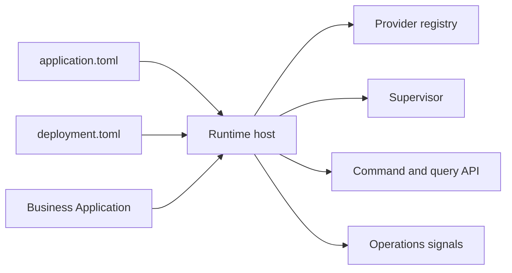

# Filosofia

## Introdução

A filosofia do projeto é separar código de negócio, infraestrutura de runtime e política de instalação.

Candidato atual: `1.0.1-rc.8`. Toolchain Rust mínima: `1.89`.

## Modelo de leitura

Leia AppCore como um conjunto de contratos, não como um monólito. `appcore-contracts` define manifests e estruturas de política, `appcore-bin` compõe o host, crates de baixo nível fornecem infraestrutura limitada e repositórios de aplicação fornecem comportamento de domínio.

## Use quando

- A aplicação precisa rodar a partir de manifests portáveis.
- Escolhas de instalação não podem vazar para o código de negócio.
- Commands, queries, auditoria, storage, sync, scheduling e supervisão precisam de um único modelo de runtime.
- Você precisa de operação local-first ou distribuída com escolhas explícitas de provider.

## Evite quando

- Um handler HTTP stateless é suficiente.
- Você precisa de ORM ou abstração de banco de dados gerenciado.
- Você espera workflows de negócio embutidos.
- Você precisa de semântica de consenso multi-master.

## Páginas relacionadas

- [Instalação](/pt/getting-started/installation)
- [Visão geral da arquitetura](/pt/architecture/overview)
- [Status do projeto](/pt/introduction/project-status)
