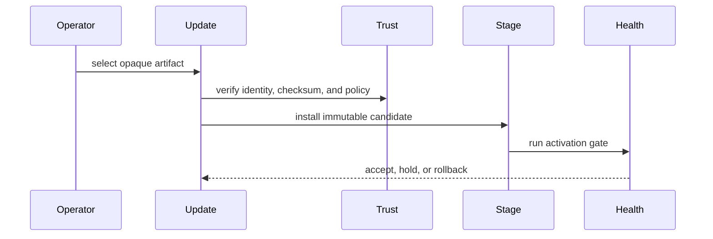

# Recuperação de desastre

## Introdução

Operations covers backup validation, restore rehearsal, provider replacement, secret recovery, and operational decision records.

## Forma do runbook

1. Confirm the runtime version and manifest versions.
2. Validate provider availability and secret references.
3. Check service health and degraded reasons.
4. Inspect bounded logs and metrics using correlation IDs.
5. Decide whether to retry, degrade, roll back, restore, or stop.

## Commands

```bash
make doctor
make docs.check
make verify
make ci
make release.local
```

## Fluxo interno



## Checklist do operador

- Do not set `require_auth = false` on an untrusted listener.
- Keep inbound TLS and edge policy explicit.
- Rehearse restore before relying on backups.
- Treat unavailable providers as bootstrap failures, not fallback opportunities.
- Keep process supervision outside the runtime supervisor.

## Limitações

AppCore exposes operational state and contracts. It does not operate cloud accounts, rotate external credentials automatically, provision TLS, or choose customer-specific backup retention.

## Páginas relacionadas

- [Secure Deployment](/pt/security/secure-deployment)
- [Supervisor](/pt/crates/appcore-supervisor)
- [Troubleshooting](/pt/operations/troubleshooting)
