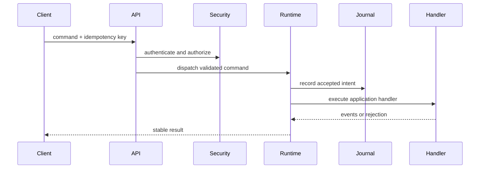

# Provider customizado

## Introdução

This tutorial builds a custom provider profile selected through deployment configuration. It keeps the runtime shape visible: command input, idempotency, event output, projection, and manifest/deployment boundaries.

## Ordem de construção

1. Define command and event types.
2. Implement the service handler.
3. Add a portable capability declaration.
4. Select local providers in deployment configuration.
5. Add tests for duplicate command keys and recovery.

## Código do serviço

```rust
use serde::{Deserialize, Serialize};
use std::collections::BTreeMap;

#[derive(Debug, Clone, Serialize, Deserialize)]
pub struct Command {
    pub tenant_id: String,
    pub idempotency_key: String,
    pub key: String,
    pub value: String,
}

#[derive(Debug, Clone, Serialize, Deserialize)]
pub enum Event {
    Recorded { key: String, value: String },
}

#[derive(Default)]
pub struct Service {
    accepted: BTreeMap<String, Event>,
    projection: BTreeMap<String, String>,
}

impl Service {
    pub fn handle(&mut self, command: Command) -> Event {
        if let Some(event) = self.accepted.get(&command.idempotency_key) {
            return event.clone();
        }
        let event = Event::Recorded { key: command.key.clone(), value: command.value.clone() };
        self.projection.insert(command.key, command.value);
        self.accepted.insert(command.idempotency_key, event.clone());
        event
    }
}
```

## Ponto de entrada do runtime

```rust
use appcore_bin::application::{run_application, Application, ApplicationResult};

struct BackendApplication;

impl Application for BackendApplication {
    fn name(&self) -> &'static str {
        "notes-backend"
    }

    fn register(&self, app: &mut appcore_bin::application::ApplicationBuilder) -> ApplicationResult<()> {
        app.command("notes.create", |ctx, payload| {
            ctx.audit("notes.create.accepted")?;
            Ok(payload)
        })?;
        Ok(())
    }
}

fn main() {
    if let Err(error) = run_application(&BackendApplication) {
        eprintln!("application failed: {error}");
        std::process::exit(1);
    }
}
```

## Manifests

```toml
manifest_version = 1
application_id = "notes"
service_id = "notes-api"
minimum_runtime_version = "1.0.1-rc.8"
protocol = "appcore.runtime/1"

[capabilities.notes]
kind = "Functional"
commands = ["notes.create", "notes.update"]
queries = ["notes.list"]
```

```toml
manifest_version = 1
installation_id = "local-dev"
mode = "standalone"

[providers.storage]
id = "file"
path = "./var/appcore/storage"

[secrets]
runtime_security = "env:APPCORE_RUNTIME_SECRET"
```

## Fluxo interno



## Hardening de produção

- Replace in-memory projection with storage-backed recovery.
- Add explicit authorization rules for every command.
- Add backup and restore tests before shipping.
- Keep sync conflict policy in application code.

## Páginas relacionadas

- [Commands](/pt/concepts/commands)
- [Events](/pt/concepts/events)
- [Deployment](/pt/operations/deployment)
