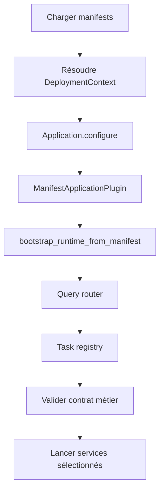

# Bootstrap et runtime host

Bootstrap commence dans `run_application`. C'est la première frontière de confiance : avant API, sync receiver ou handler applicatif, le host décide si l'installation est cohérente.

Le host lit `application.toml` et `deployment.toml` ou les overrides `APPCORE_APPLICATION_MANIFEST` et `APPCORE_DEPLOYMENT_MANIFEST`, valide les manifests et crée `ManifestApplicationHost`.

Les chemins sont canonicalisés, le TOML est parsé dans des contrats versionnés et les deux manifests doivent partager le même `application_id`. Les entrées supprimées, comme `runtime.toml` ou les configs anciennes avec `app_id` sans `manifest_version`, échouent avec `NO MORE SUPPORTED PLEASE UPDATE`.

## Pourquoi le bootstrap échoue-t-il tôt ?

Chaque fichier Application ou Deployment Manifest est limité à 1 Mio. Le host
vérifie les metadata avant l'allocation et lit via `Take(limit + 1)` ; un
fichier trop grand, en croissance concurrente ou avec un UTF-8 invalide échoue
fermé avant la composition des providers.

Les entrées supprimées échouent avant toute conversion de compatibilité. Cet
échec précoce évite qu'une installation invalide ne démarre qu'une partie de
ses services et n'atteigne un état plus difficile à diagnostiquer.

## Comment les manifests deviennent-ils une configuration Runtime ?

Le Runtime dérive `RuntimeConfig` : application ID devient l'identité de
l'application ; installation ID participe au regroupement cluster et sync ;
les IDs node, core et instance appartiennent au Runtime ; le listener vient du
deployment ; cluster mode active les defaults sync ; payloads et TTLs sont
bornés ; le watchdog vient de la policy du deployment.

## Que peut configurer l'application ?

Les commands restent protégées par le manifest. Capability absente échoue. Command exigeant une idempotency key échoue avant le handler si la clé manque.

Le manifest distribué final produit un seul `CapabilityCatalog` au bootstrap.
La façade directe, le HTTP applicatif et le Peer RPC utilisent ce même
catalogue pour contrôler déclaration, mode, idempotence, écriture
opérationnelle et leadership. Un `CapabilityRegistry` n'existe qu'avec un vrai
handler local ; les queries de statut Runtime restent explicites dans le host.

## Quand les services Runtime démarrent-ils ?

Le host peut démarrer HTTP, receiver sync, Peer RPC, worker control plane,
scheduler, service d'update et d'autres infrastructures selon le mode et les
exigences. Ces services sont enregistrés auprès du Supervisor, pas lancés sous
forme de threads détachés. Un probe de certification démarre les services
choisis, attend leur readiness avec timeout puis les arrête coopérativement.

Le candidat `appcore-api 1.0.2-rc` possède aussi une frontière opt-in de génération de routing
pour le service HTTP. Elle prépare et vérifie un Router plus récent avant une
commutation atomique, puis draine les requêtes déjà admises par l'ancienne
génération. Ce n'est pas un watcher implicite du manifest V1. Voir
[reload coordonné](./reload).

## Que signifie le shutdown ?

Le shutdown ne tue pas le processus. Le host fait passer le lifecycle par les
états shutdown demandé et terminé. L'arrêt est coopératif ; le Supervisor peut
mettre en quarantine un service qui ne s'arrête pas, mais ne peut pas terminer
en sécurité du code arbitraire dans le processus.

## Limites

- Bootstrap n'infère pas les providers et ne fait pas de fallback silencieux.
- Les anciennes configs non versionnées ne sont pas converties.
- Les tasks métier ne démarrent pas hors scheduler runtime.
- Les commands non déclarées dans le manifest sont rejetées.
- L'update automatique exige le chemin supervisé ; une exécution directe non managée rejette ce mode.

Suivant : [storage](/architecture/storage).
