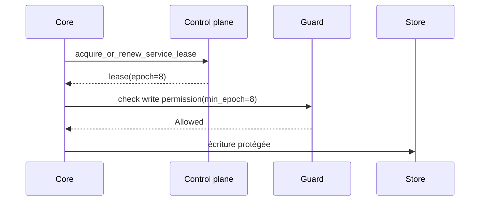

# Fonctionnement distribué

Imaginez un core qui revient après une pause réseau et croit encore être leader. Un autre core a déjà renouvelé le lease. Le problème n'est pas seulement l'élection ; il faut empêcher l'ancien leader de commit.

Le distribué AppCore combine control plane, leases, discovery, Peer RPC, gateway mesh relay et providers de coordination explicites.

Le file control plane prend un lock, recharge un état validé et borné, supprime les enregistrements expirés, applique une opération et persiste atomiquement.

Leadership est scoped par `service_id`. Un lease contient service, tenant, cluster, holder core, expiry et epoch. L'epoch est le fencing token.



Peer RPC valide request ID, trace, protocole, source/target core, tenant, cluster, timestamp, expiry, nonce, capability, body hash et idempotency key optionnelle. Gateway existe pour les cores sans port entrant stable. Il relaie et route, mais n'interprète jamais le payload métier opaque.

Les rejets V2 sont typés et bornés. Un code fixe détermine phase et si une
opération idempotente de niveau supérieur peut retenter; le peer ne déclare pas
retryability indépendamment. Des métadonnées inconnues ou contradictoires
échouent de façon conservatrice. V1 conserve le champ string, mais le client ne
reconnaît que les codes contrôlés exacts et n'interprète jamais de sous-chaîne.
La sélection V2 est une décision de deployment explicite et coordonnée; les
peers V1 ne sont ni mis à niveau ni redirigés.

L'activation Gateway est déclarative. Quand le Deployment Manifest sélectionne
l'adapter, l'exécutable de déploiement valide la configuration, ajoute et autorise
`runtime.gateway` dans le catalogue partagé, réutilise la sécurité Runtime et
enregistre le Gateway comme service critique du Supervisor :

```toml
[adapters.gateway]
provider_id = "appcore-gateway"
settings = { bind_address = "127.0.0.1:8080", domain_suffix = "gateway.example.com", heartbeat_interval_ms = "30000", heartbeat_timeout_ms = "90000" }
secret_refs = {}
```

Seuls ces quatre settings non secrets sont acceptés. Settings inconnus,
endpoints, références de secret et overrides d'authentification échouent
fermés. Sans l'adapter, aucun listener ni task Gateway n'est créé ; une
configuration ou un bind invalide arrête le startup.

Le host utilise un replay store durable et sûr entre processus. Standalone le
place dans le storage privé ; cluster exige un `paths.gateway_replay` absolu
vers un fichier inscriptible partagé par toutes les instances. Les sockets
expirent en 60 secondes maximum et le shutdown borné ferme les connexions
incomplètes.

## Limitations

- Le file control plane est une référence pour répertoire partagé, pas un consensus global.
- Les leases exigent TTLs et horloges configurés prudemment.
- Peer RPC authentifie l'enveloppe runtime ; l'autorisation métier appartient à l'application.
- Gateway relaie des payloads opaques et ne résout pas les conflits.
- Gateway en cluster échoue fermé sans replay file partagé explicite.
- Provider absent échoue le startup ; AppCore ne bascule pas vers une option plus faible.

Suivant : [supervisor](/architecture/supervisor).
