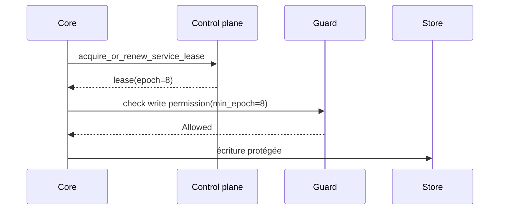

# Fonctionnement distribué

Imaginez un core qui revient après une pause réseau et croit encore être leader. Un autre core a déjà renouvelé le lease. Le problème n'est pas seulement l'élection ; il faut empêcher l'ancien leader de commit.

Le distribué AppCore combine control plane, leases, discovery, Peer RPC, gateway mesh relay et providers de coordination explicites.

Le file control plane prend un lock, recharge un état validé et borné, supprime les enregistrements expirés, applique une opération et persiste atomiquement.

Leadership est scoped par `service_id`. Un lease contient service, tenant, cluster, holder core, expiry et epoch. L'epoch est le fencing token.

Peer RPC valide request ID, trace, protocole, source/target core, tenant, cluster, timestamp, expiry, nonce, capability, body hash et idempotency key optionnelle. Gateway existe pour les cores sans port entrant stable. Il relaie et route, mais n'interprète jamais le payload métier opaque.

## Limitations

- Le file control plane est une référence pour répertoire partagé, pas un consensus global.
- Les leases exigent TTLs et horloges configurés prudemment.
- Peer RPC authentifie l'enveloppe runtime ; l'autorisation métier appartient à l'application.
- Gateway relaie des payloads opaques et ne résout pas les conflits.
- Provider absent échoue le startup ; AppCore ne bascule pas vers une option plus faible.

Suivant : [supervisor](/architecture/supervisor).
