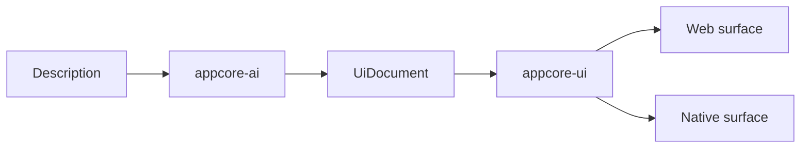
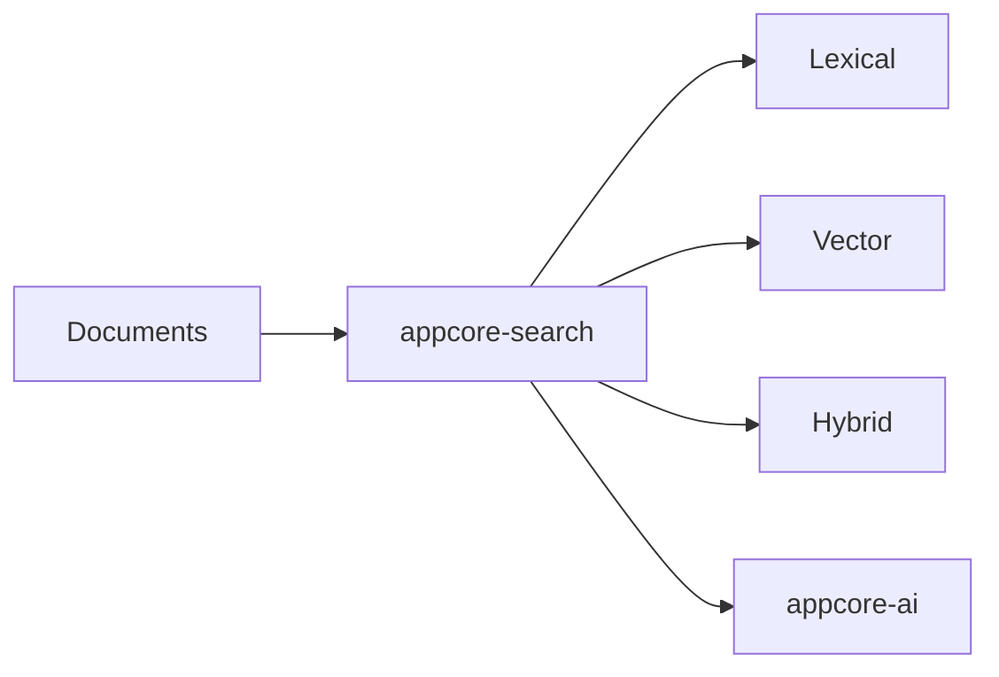
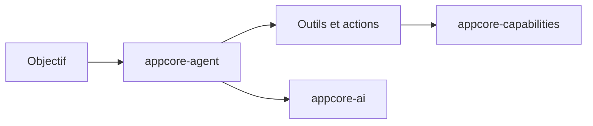
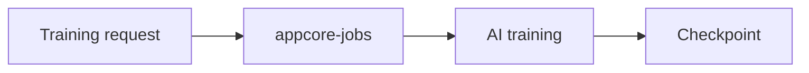
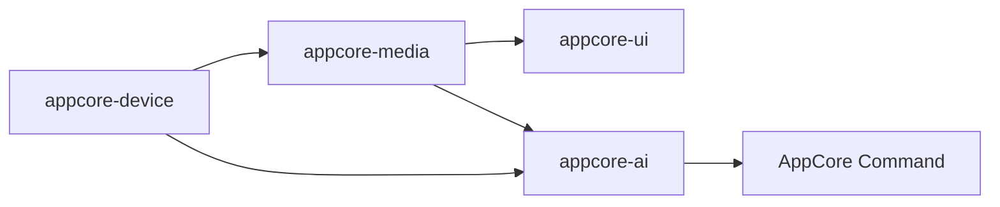
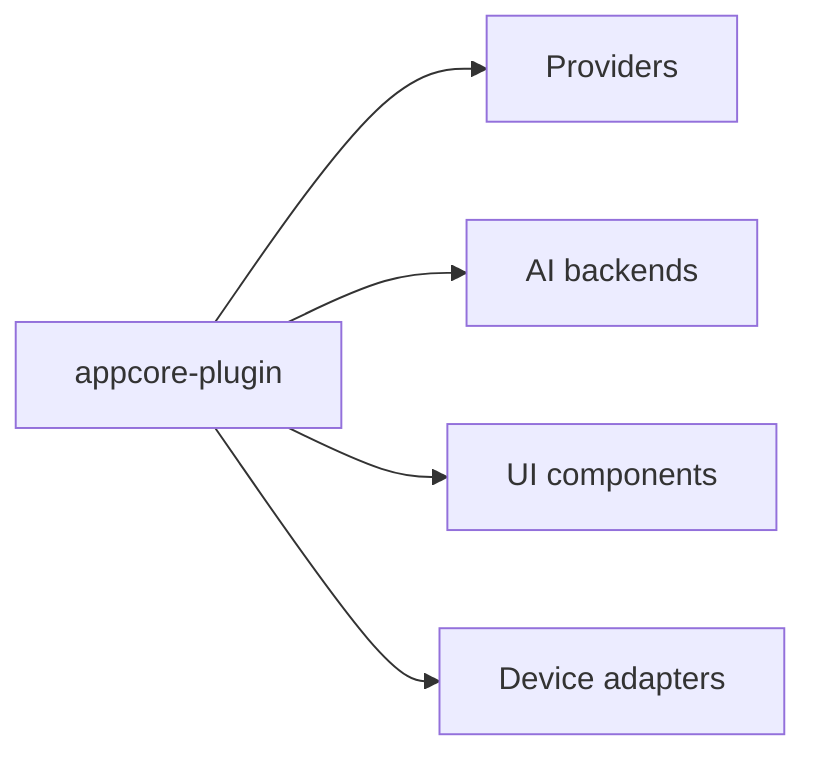

# Architecture future

:::caution Roadmap conceptuelle
Cette page décrit des idées d'architecture future. Elle ne modifie **pas**
l'architecture Runtime actuelle ni le catalogue actuel des crates publics.
:::

Le travail futur dans AppCore suit la même règle que le Runtime actuel : un
crate existe seulement avec propriétaire clair, consommateurs, frontière de
dépendances, tests, chemin de publication et documentation.

## Flux Conceptuels

Automation déterministe et agents adaptatifs restent séparés. Automation est
`Event -> Condition -> Action -> Command`. Les agents traitent objectifs,
planning, outils, mémoire et propositions d'action via IA et capabilities.

L'entraînement, s'il est supporté, doit être explicite :

Media et devices sont aussi des frontières :

Plugins composent les points d'extension :

## Profils

- application desktop ;
- application desktop IA ;
- backend distribué ;
- installation edge ou IoT ;
- application media ;
- plateforme d'agents ;
- outil de développement visuel.

## Non-Objectifs

AppCore ne vise pas à devenir :

- système d'exploitation ;
- database universelle ;
- browser engine ;
- framework complet de machine learning ;
- graphics engine réinventé ;
- stack cryptographique propre ;
- cloud provider ;
- monolithe.

## Principes

- Préférer la standard library Rust ou les crates internes avant les dépendances externes.
- Garder le comportement local-first possible.
- Utiliser le distribué seulement quand le deployment en a besoin.
- Router les extensions par capabilities et providers explicites.
- Garder les features lourdes opt-in.
- Ne pas laisser les détails d'implémentation fuiter dans l'API centrale.
- Exiger propriétaire, consommateurs, position DAG, tests, publication et docs avant de créer une crate.

## Maturité

Research signifie que la frontière est encore investiguée. Planned réserve une
frontière utile. In Design signifie que la forme publique est en conception.
Alpha, Beta et RC indiquent une confiance croissante d'implémentation et de
release. Stable signifie crate publiée avec son propre contrat SemVer.
