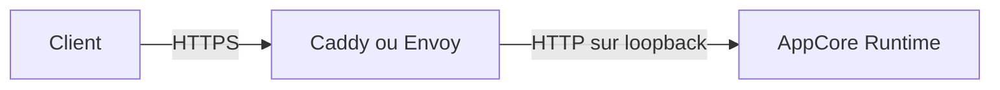

# Sidecar TLS entrant

Le TLS entrant appartient à la frontière de déploiement. AppCore écoute
uniquement en HTTP loopback ; Caddy ou Envoy possède le socket TLS public, les
certificats, les contrôles de santé et le transfert. Le Runtime ne lit jamais
la clé privée et ne fournit aucun fallback en clair.

La source post-1.0 fournit Caddy 2.11.4 pour systemd, launchd et Windows/WinSW,
ainsi qu'Envoy 1.39.0 pour systemd. Il s'agit de développement, pas de la
surface stable 1.0.

## Forme de déploiement obligatoire

- Lier le Runtime à `127.0.0.1:<port>` et interdire l'accès distant par pare-feu.
- Exposer le sidecar uniquement en TLS et garder son admin en loopback.
- Protéger les chemins certificat/clé ; ne jamais placer les octets de clé dans manifests, arguments ou logs.
- Démarrer Runtime puis sidecar. Publier seulement après le succès HTTPS de `/v1/health` avec nom et chaîne validés.
- La readiness est le health HTTPS externe ; liveness et health loopback sont diagnostiques.

Les templates sont sous `packaging/tls-sidecar` dans la source beta privée.
`appcore-dev service check` interdit de retirer l'upstream loopback, les entrées
TLS, les health checks bornés, les limites ou le durcissement du service. Envoy
utilise la ressource filesystem-SDS séparée `envoy/tls-secret.yaml` ; un
certificat statique dans `CommonTlsContext` ne se recharge pas à chaud.

## Rotation et rollback

Vérifier la paire complète sous un nouveau chemin owner-only et la publier
atomiquement. Caddy valide et recharge le candidat ; Envoy observe les moves
atomiques du symlink d'un répertoire versionné via filesystem SDS. Garder la
paire précédente jusqu'au health HTTPS.

Un échec conserve ou restaure la paire précédente. Si le sidecar s'arrête,
l'endpoint public devient indisponible et le port Runtime reste inaccessible.
Si le Runtime s'arrête, le sidecar marque l'upstream unhealthy sans alternative
ou destination en clair.

La rotation ne change pas la routing generation AppCore : les requêtes acceptées
restent au sidecar et le listener Runtime demeure stable. Le changement
d'adresse appartient au routing externe du déploiement.

## Certification du dépôt et limites

Exécutez `appcore-dev cert tls-sidecar` pour certifier les deux profils sous
Docker Linux et écrire `builds/certification/tls-sidecar.json`. Le gate utilise
un nom d'hôte et une chaîne approuvés localement et vérifie la readiness HTTPS,
le refus cleartext, 512 requêtes acceptées pendant la rotation, le changement
de série, le rollback d'un candidat invalide, le redémarrage du sidecar et
l'échec fermé lors de la perte du Runtime. Envoy limite aussi globalement les
connexions downstream à 1 024.

Ceci termine le profil AC-024 appartenant au dépôt sans certifier un hôte de
production. AC-010 suit les service managers Windows/Unix réels, les pare-feu
hôte, l'expiration/révocation des certificats de production, le soak cluster de
24 heures et l'audit de sécurité indépendant. La certification Windows des
secrets au repos dépend aussi d'AC-009.

Continuez avec le [reload HTTP coordonné](./reload).
