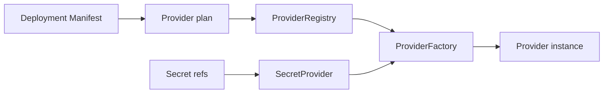

# Providers

La même application peut tourner sur un laptop, un notebook de boutique ou un cluster. Si le choix d'infrastructure vit dans le code métier, chaque installation devient un build différent.

Providers sont la frontière d'installation. Le deployment choisit l'infrastructure sans changer l'artefact applicatif.

## Que choisit le deployment ?

`DeploymentProviderPlan` extrait :

- storage ;
- control plane ;
- coordination store ;
- secret provider ;
- job provider ;
- peer discovery ;
- update provider ;
- database provider ;
- peer transport ;
- command transport ;
- adapters nommés.

Le contexte ne contient que application ID, installation ID et mode Runtime,
jamais les secrets.

## Pourquoi n'existe-t-il aucun fallback implicite ?

Une factory est enregistrée par role et provider ID. Si la paire sélectionnée n'existe pas, creation échoue. Il n'y a pas de fallback implicite.

La sélection storage exécute aussi un preflight explicite de capacités
post-1.0. Un descriptor borné déclare des garanties exactes plutôt que des noms
d'implémentation; le provider sélectionné doit satisfaire chaque exigence avant
l'ouverture. Voir [preflight des capacités storage](/architecture/storage-provider-capabilities).

## À quoi sert le coordination store ?

Le coordination store possède les metadata de schéma Runtime, dont le fichier
versionné `coordination-schema.meta`. Il migre les versions antérieures et
rejette les versions futures incompatibles. Ce n'est pas une base métier.

## Pourquoi les manifests gardent-ils des références de secrets ?

Le secret provider résout des références comme `env:APPCORE_EXAMPLE_SECRET`
après validation, gardant les valeurs hors des manifests et de l'application.

## Que prouve un lease sur filesystem ?

Le lease de ressource partagée sur filesystem persiste un sidecar versionné du
plus grand epoch avant de publier le lease actif. Release, restart et
acquisition interrompue ne réutilisent donc pas d'epoch. Celui-ci ne sert de
fencing token que si chaque writer protégé le compare avant l'écriture ; un
filesystem sans lock, rename, sync de répertoire et cohérence de cache fiables
n'empêche pas seul le split-brain.

## Que doit documenter un provider de production ?

- limites de timeout, retry, file et payload ;
- authentification et ownership des secrets ;
- health et comportement de dégradation ;
- garanties de persistance et récupération ;
- policy de migration et compatibilité ;
- diagnostics expurgés ;
- tests de conformité et d'échec.

## Limites

- Providers ne rendent pas standalone et cluster équivalents ; chaque mode a ses exigences.
- Provider sélectionné et absent échoue la creation au lieu de fallback.
- Secret provider résout des références, mais AppCore ne fournit pas de vault managé.
- Coordination store est infrastructure runtime, pas database applicative.
- Health provider indique disponibilité d'infrastructure, pas correction métier.

Suivant : [première application](/tutorials/first-application).
