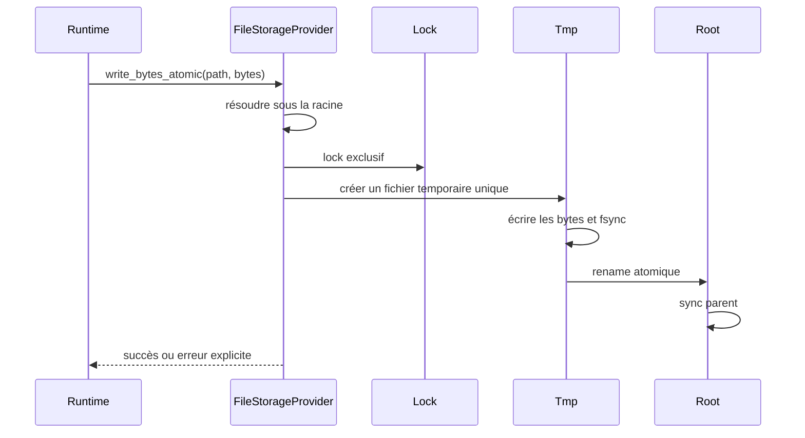
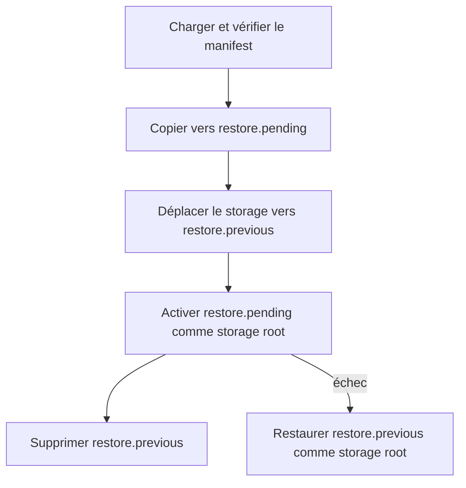
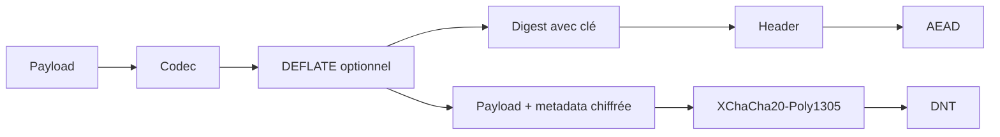

# Storage, DNT, backup et restore

Imaginez une boutique qui écrit un devis quand le portable s'éteint. Au prochain boot, l'opérateur ne devrait pas deviner si le fichier contient moitié ancien état et moitié nouveau.

C'est le problème de storage qu'AppCore traite. Le storage AppCore n'est pas un ORM. C'est la frontière runtime pour fichiers durables, backup, restore, objets DNT, lectures authentifiées et health du provider.

Le provider de référence utilise des fichiers locaux. Son comportement est
volontairement conservateur car il stocke aussi l'état Runtime : logs,
snapshots, bundles de backup, nonce stores et metadata de coordination.

## Pourquoi ne pas écrire directement le fichier final ?

Parce qu'une interruption pendant l'écriture peut rendre l'état ambigu. Un log de sync, un nonce store, un backup manifest ou un objet DNT doit être complet ou rejeté.

Le file provider suit un petit protocole :

1. résoudre le chemin sous la racine configurée ;
2. rejeter chemin absolu, `..`, prefix et symlink ;
3. prendre un lock quand la cohérence l'exige ;
4. écrire dans un fichier temporaire ;
5. appeler `sync_all` ;
6. remplacer avec rename atomique ;
7. synchroniser le répertoire parent quand le système le permet.

Le baseline local fournit :

- résolution des paths sous les roots configurées ;
- rejet des paths absolus, traversal, prefixes et symlinks ;
- fichiers temporaires, `sync_all`, rename atomique et sync du parent ;
- file lock du système pour les opérations cohérentes ;
- échec explicite pour les transactions non supportées.

Aucun filesystem n'est parfait. AppCore utilise le modèle portable le plus
fort qu'il peut vérifier et renvoie une erreur explicite lorsqu'une garantie de
lock, flush ou rename n'est pas disponible.

## Pourquoi borner les lectures ?

Certains formats doivent être lus entièrement pour être vérifiés : DNT, checkpoint, backup manifest, update artifact, nonce store et état du control plane. AppCore rejette les fichiers trop grands avant allocation non bornée.

Ce principe couvre aussi logs sync, objets DNT, manifests de backup, artefacts
d'update, stores de nonce et état control plane. Tous ont des plafonds d'octets
explicites parce qu'un fichier local peut être corrompu ou hostile. Une lecture
complète n'autorise jamais une allocation sans limite.

Le housekeeping et la traversée des backups sont itératifs et bornés ; ils ne
suivent jamais les symlinks ni les reparse points Windows. L'ouverture finale
utilise le mode no-follow de la plateforme et est revalidée avec le lock du
processus. Les listings préfèrent le timestamp persisté dans le manifest du
snapshot.

## Que se passe-t-il pendant un snapshot backup ?

Backup snapshot utilise `appcore-storage-backup-v1`, inventaire trié, taille et SHA-256 par fichier. Restore copie le backup vérifié vers `restore.pending`, déplace le storage actuel vers `restore.previous`, active pending comme racine et nettoie previous. La récupération choisit pending/previous/current sans perdre la dernière racine valide.

Le manifest contient :

- marqueur `appcore-storage-backup-v1` ;
- nom du backup ;
- creation time ;
- inventaire trié des fichiers ;
- taille de chaque fichier ;
- SHA-256 de chaque fichier.

Le répertoire final n'apparaît qu'après accord entre manifest et fichiers copiés. Restore ne fait pas confiance à une simple liste de fichiers ; il vérifie inventaire, tailles et hashes.

La création ne copie que les fichiers réguliers, synchronise contenu et
répertoires et rejette noms déjà utilisés et symlinks. Le nombre de fichiers et
la taille du manifest sont bornés. Le manifest est le point d'audit : restore
valide l'inventaire déclaré avant toute activation.

## Comment restore récupère-t-il après un crash ?

Restore effectue un échange de répertoires récupérable et rend chaque état
visible :

Restore est plus difficile car deux vérités coexistent pendant l'échange : la
root ancienne et le candidat vérifié. Des noms fixes rendent donc les états
visibles. À la récupération, pending est choisi sans root courante, previous
est choisi s'il reste la dernière copie valide, et previous est nettoyé lorsque
la root courante est déjà active.

## Pourquoi DNT authentifie le contexte ?

DNT est une enveloppe binaire authentifiée et chiffrée. Le header contient application ID, tenant optionnel, content type, codec, key ID, schema version, nonce, payload hash et metadata. Le header est AEAD additional data : modifier le contexte casse l'authentification.

L'envelope contient :

- magic bytes `APDNT` ;
- envelope version ;
- flags ;
- algorithm ID ;
- application ID ;
- tenant ID facultatif ;
- content type logique ;
- codec ID ;
- key ID ;
- schema version ;
- creation time ;
- payload length ;
- nonce XChaCha20-Poly1305 ;
- hash du payload avec clé ;
- metadata publique authentifiée ;
- taille des metadata chiffrées ;
- ciphertext.

`read_verified` exige une limite de payload et rejette les grands fichiers
avant de tout charger. `open_owned` authentifie et ouvre un buffer possédé ; le
plaintext retourné peut être remis à zéro.

Le header entier est additional data de l'AEAD. Application ID, tenant, content
type, codec, schema, key et metadata ne peuvent donc changer sans échec
d'authentification. `open_owned` déchiffre in-place après admission du buffer
borné ; `zeroize_plaintext` efface le contenu lorsqu'il n'est plus nécessaire.

## Quels compromis ce modèle de storage impose-t-il ?

Le file provider est simple et inspectable, mais ce n'est pas une base
distribuée multi-writer. Le profil local attend un processus et un filesystem
qui respecte locks, sync et rename atomique. La coordination cluster emploie
des providers explicites. Ce choix préserve les petites installations
local-first sans prétendre qu'un répertoire partagé est une database générale.

Exiger une database pour chaque installation simplifierait la concurrence en
cluster, mais affaiblirait le profil offline et alourdirait fortement la plus
petite installation valide. AppCore préfère un provider local conservateur et
rend la coordination distribuée explicite.

## Limites

- Le file provider n'est pas une base distribuée multi-writer.
- AppCore ne compense pas un filesystem qui ment sur locks, flush ou rename atomique.
- Le profil mono-processus suppose un root protégé par son propriétaire ; un
  processus hostile du même compte remplaçant un répertoire ancêtre pendant
  l'opération reste hors de cette frontière portable.
- Backup couvre la racine de storage du runtime, pas les bases externes ni les effets métier.
- DNT protège bytes et contexte authentifié ; il ne définit pas l'autorisation métier.
- Restore n'annule pas les actions externes exécutées par les handlers applicatifs.

Suivant : [sync](/fr/architecture/synchronization).
