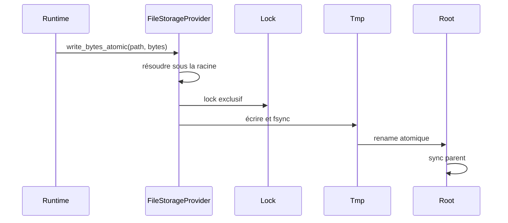

# Storage, DNT, backup et restore

Imaginez une boutique qui écrit un devis quand le portable s'éteint. Au prochain boot, l'opérateur ne devrait pas deviner si le fichier contient moitié ancien état et moitié nouveau.

C'est le problème de storage qu'AppCore traite. Le storage AppCore n'est pas un ORM. C'est la frontière runtime pour fichiers durables, backup, restore, objets DNT, lectures authentifiées et health du provider.

## Pourquoi ne pas écrire directement le fichier final ?

Parce qu'une interruption pendant l'écriture peut rendre l'état ambigu. Un log de sync, un nonce store, un backup manifest ou un objet DNT doit être complet ou rejeté.

Le file provider suit un petit protocole :

1. résoudre le chemin sous la racine configurée ;
2. rejeter chemin absolu, `..`, prefix et symlink ;
3. prendre un lock quand la cohérence l'exige ;
4. écrire dans un fichier temporaire ;
5. appeler `sync_all` ;
6. remplacer avec rename atomique ;
7. synchroniser le répertoire parent quand le système le permet.

## Pourquoi borner les lectures ?

Certains formats doivent être lus entièrement pour être vérifiés : DNT, checkpoint, backup manifest, update artifact, nonce store et état du control plane. AppCore rejette les fichiers trop grands avant allocation non bornée.

## Que se passe-t-il pendant un snapshot backup ?

Backup snapshot utilise `appcore-storage-backup-v1`, inventaire trié, taille et SHA-256 par fichier. Restore copie le backup vérifié vers `restore.pending`, déplace le storage actuel vers `restore.previous`, active pending comme racine et nettoie previous. La récupération choisit pending/previous/current sans perdre la dernière racine valide.

Le répertoire final n'apparaît qu'après accord entre manifest et fichiers copiés. Restore ne fait pas confiance à une simple liste de fichiers ; il vérifie inventaire, tailles et hashes.

## Pourquoi DNT authentifie le contexte ?

DNT est une enveloppe binaire authentifiée et chiffrée. Le header contient application ID, tenant optionnel, content type, codec, key ID, schema version, nonce, payload hash et metadata. Le header est AEAD additional data : modifier le contexte casse l'authentification.

## Limitations

- Le file provider n'est pas une base distribuée multi-writer.
- AppCore ne compense pas un filesystem qui ment sur locks, flush ou rename atomique.
- Backup couvre la racine de storage du runtime, pas les bases externes ni les effets métier.
- DNT protège bytes et contexte authentifié ; il ne définit pas l'autorisation métier.
- Restore n'annule pas les actions externes exécutées par les handlers applicatifs.

Suivant : [sync](/architecture/synchronization).
