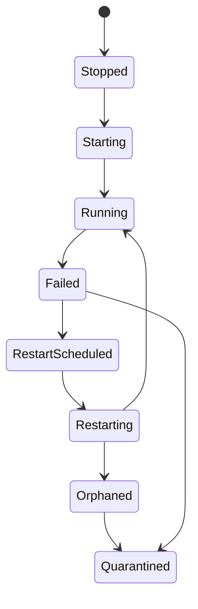

# Supervisor et cycle de vie

Si le sync receiver démarre avant un storage sain, ou si un worker échoue en boucle et déclenche des restarts illimités, le runtime perd sa prévisibilité. Le supervisor transforme ces cas en états observables.

`appcore-supervisor` orchestre des services dans le processus. Il ne redémarre pas le processus AppCore ; systemd, launchd, Windows Service Control Manager, container runtime ou orchestrateur restent propriétaires du processus.

Les services déclarent nom, resource, dépendances, restart policy, activation et criticité. Le supervisor valide les dépendances, calcule l'ordre topologique, démarre dans l'ordre et stoppe coopérativement.

Restart est planifié : budget, backoff/jitter, executor borné, completion. Budget épuisé mène à quarantine et action opérateur. Un worker non stoppable devient orphaned/quarantined au lieu d'être ignoré.

Le owner de routing HTTP coordonné reste le service géré `http`
existant. Ses générations internes n'enregistrent aucun autre Supervisor et ne
redémarrent pas le processus. Voir [reload coordonné](./reload).

## Limitations

- Le supervisor ne redémarre pas le processus, seulement les services dans le processus.
- Shutdown est coopératif ; AppCore ne tue pas du code arbitraire en sécurité.
- Le budget de restart évite les storms, mais peut laisser un service en quarantine.
- Health de service ne prouve pas la correction métier.
- L'ordre des dépendances évite des races connues, mais ne rend pas une dépendance saine.

Suivant : [updates](/architecture/updates).
