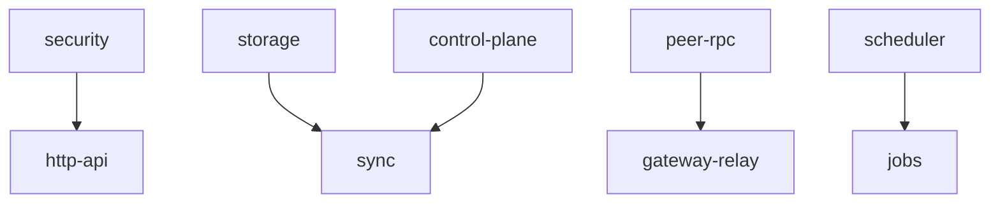
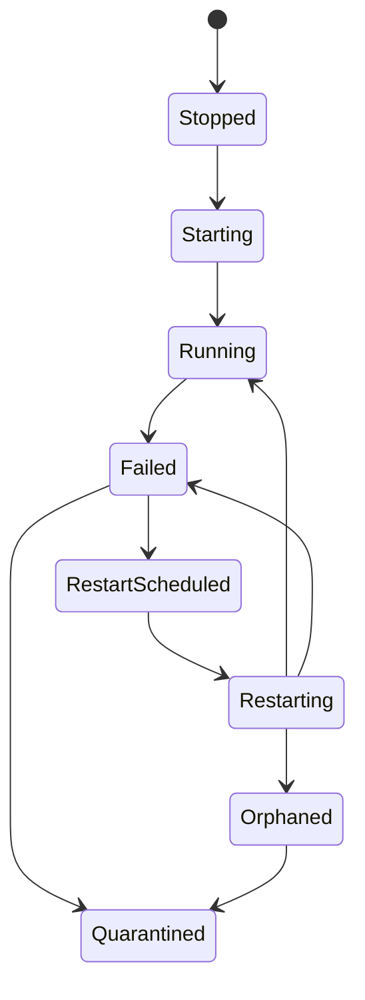

# Supervisor et cycle de vie

Supposons que le receiver de sync démarre avant que le storage soit sain. Ou
qu'un worker du gateway échoue sans cesse et que chaque échec crée une nouvelle
tentative de restart. Un runtime sans supervision transforme ces situations en
comportement caché en arrière-plan.

`appcore-supervisor` orchestre les services localement dans le processus. Il
démarre et arrête les services appartenant au Runtime, vérifie les dépendances,
suit leur health, planifie des restarts bornés, émet des événements et expose
des diagnostics.

Il ne redémarre pas le processus AppCore. Cette responsabilité reste celle de
systemd, launchd, Windows Service Control Manager, d'un runtime de containers
ou d'un autre process manager.

## Qu'est-ce qu'un service géré ?

Chaque service fournit un descriptor :

- nom stable du service ;
- type de ressource gérée ;
- dépendances ;
- politique de restart ;
- état d'activation ;
- indication que l'échec est critique.

Les noms sont bornés et limités aux caractères ASCII alphanumériques plus `.`,
`-` et `_`. Un service ne peut pas dépendre de lui-même. La validation des
dépendances et l'ordre topologique précèdent `start_all`.

## Comment le startup évite-t-il les races de dépendances ?

Le supervisor démarre les services activés dans l'ordre des dépendances. Avant
d'en démarrer un, il compare la health de ses dépendances à l'exigence
déclarée. Une dépendance absente ou insuffisante dégrade ses dépendants au lieu
de déclencher une tempête de restarts.

## Pourquoi les restarts sont-ils planifiés plutôt qu'immédiats ?

Le restart est planifié et non exécuté inline. Le supervisor :

1. vérifie qu'il est permis et pas déjà actif ;
2. consomme le budget dans la fenêtre de restart ;
3. ajoute backoff et jitter ;
4. marque le service comme planifié ;
5. soumet la commande à l'executor borné lorsqu'elle arrive à échéance ;
6. applique l'état de completion.

Une file pleine ne crée pas de travail illimité. Lorsque le budget est épuisé,
le service est placé en quarantine et exige l'action d'un opérateur.

## Que se passe-t-il si le shutdown ne prouve pas l'arrêt d'un worker ?

Le shutdown est coopératif. Si un service ne peut pas être arrêté en sécurité
et qu'un restart laisserait derrière lui un worker inconnu, le supervisor le
marque orphaned et quarantined et émet les deux événements. C'est plus sûr que
de prétendre que l'ancien worker a disparu.

## Que prouve le watchdog ?

Le watchdog permet aux consommateurs de health de distinguer un runtime
réactif d'un runtime bloqué. La politique de deployment contrôle l'intervalle
de check et le timeout de stall. Le watchdog ne supervise pas le processus ;
c'est un signal interne utilisable par un process manager ou un opérateur.

## Pourquoi ce composant reste-t-il hors d'`appcore-core` ?

Le core possède le dispatch des commands, les registries, l'audit et l'état de
lifecycle. Le supervisor possède l'orchestration des services. Cette séparation
empêche le dispatch de dépendre d'une mécanique concrète de restart et permet
aux services d'infrastructure de partager un seul modèle de lifecycle.

Le owner de routing HTTP coordonné reste le service géré `http` existant. Ses
générations internes n'enregistrent aucun autre Supervisor et ne redémarrent
pas le processus. Voir [reload coordonné](./reload).

## Limites

- Le supervisor ne redémarre pas le processus ; il ne gère que ses services.
- Le shutdown est coopératif ; AppCore ne peut pas arrêter en sécurité du code
  arbitraire dans le processus.
- Les budgets de restart évitent les storms : un service qui échoue sans cesse
  peut rester en quarantine jusqu'à l'action d'un opérateur.
- Les health checks décrivent les services Runtime, pas la correction métier
  de bout en bout.
- L'ordre des dépendances évite les races connues, mais ne rend pas saine une
  dépendance unhealthy.

Continuez avec [updates](/fr/architecture/updates).
