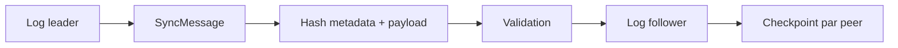

# Sync, logs, checkpoints et replay

Imaginez une boutique sans Internet pendant huit heures. L'opérateur continue à créer des devis. Quand le réseau revient, le runtime doit savoir ce qui a déjà été envoyé, ce qui est nouveau, ce qui est retry et ce qui est conflit.

Sync dans AppCore est une réplication conservative leader-to-follower. Ce n'est pas RAFT, multi-master ou un résolveur de conflits métier.

## Que se passe-t-il à la reconnexion ?

Quand la boutique perd Internet, les commands locales peuvent continuer selon la politique de storage et command. Quand le réseau revient, le receiver valide identité, protocole, séquence, count, taille, hash, previous hash et checkpoint.

Même séquence et même payload signifie retry. Même séquence et bytes différents signifie conflit.

Le log file-backed utilise `# appcore-replication-log-v1`, limite total, limite par record, sequence map, hash chain, lock et atomic write. Append par séquence est idempotent : même séquence/même payload retourne l'index original ; même séquence/payload différent est un conflit.

Le log est la preuve utilisée par replay. Sans lui, recovery devrait faire confiance aux projections applicatives, qui peuvent être compactées, migrées ou reconstruites partiellement.

## Pourquoi un checkpoint si replay existe ?

Checkpoint garde dernière séquence acceptée et batch hash par peer dans `# appcore-sync-checkpoint-v1`. Sans checkpoint, recovery devrait replay tout l'historique ou deviner depuis une projection.

## Comment l'outbox durable récupère-t-elle ?

L'outbox fichier de la version candidate 1.5 utilise le marqueur binaire
explicite `appcore-sync-outbox-v2`. Chaque enqueue ou ACK ajoute et synchronise
une frame bornée. Les ordinaux, longueurs initiale/finale et une chaîne SHA-256
détectent corruption, duplication et réordonnancement. Seule une frame finale
incomplète est tronquée après un crash ; une frame complète invalide échoue de
manière fermée.

L'espace acquitté est récupéré par compaction atomique, qui écrit uniquement
les messages en attente et change la génération. Un autre processus avec une
vue ancienne détecte ce changement et recharge. Le journal reste limité à 64
MiB et réserve assez de tail pour acquitter le message frontal déjà accepté.

Le contrat outbox de la version candidate 1.5 lit un préfixe ordonné avec
des limites indépendantes de nombre et d'octets encodés avant de cloner les
payloads. Il expose des stats sans payload, persiste les attempts/readiness
retry et applique uniquement des receipts de préfixe ordonné exact. Le follower
et la CLI Runtime utilisent directement ce chemin : la croissance de la file
ne détermine ni une allocation unique de livraison ni le progrès du checkpoint.

Il s'agit d'une frontière explicite de format persistant. Les fichiers V1, sans
version ou futurs retournent `NO MORE SUPPORTED PLEASE UPDATE` ; le Runtime ne
les déduit ni ne les convertit. Les opérateurs vident V1 avant la mise à niveau
et V2 avant un rollback.

Idempotency de command et idempotency de batch ne protègent pas la même frontière. La key de command évite de dupliquer un retry client. Séquence/checkpoint évitent de dupliquer une réplication peer.

## Persistance SQLite facultative après la 1.0

L'aperçu post-1.0 publié `appcore-sync-sqlite 0.1.0-alpha.2` persiste uniquement les enregistrements
de synchronisation du Runtime : replication log, outbox, checkpoints par peer
et tombstones opaques. Il utilise un schéma interne versionné, WAL,
synchronisation complète, connexions et limites bornées, snapshots portables,
sauvegarde en ligne vérifiée et contrôle d'intégrité fermé en cas d'échec. Il
n'expose jamais de SQL arbitraire ni de tables applicatives.

Le provider accepte des processus locaux indépendants sur un filesystem au
locking fiable. Les partages réseau, SQLite multi-host et la sélection
automatique par le manifest V1 gelé sont hors contrat. Un schéma interne
inconnu ou futur retourne `NO MORE SUPPORTED PLEASE UPDATE` ; aucun format du
file provider n'est importé par inférence. Voir
[l'aperçu `appcore-sync-sqlite`](../crates/appcore-sync-sqlite).

## Limitations

- Sync est leader-to-follower, pas RAFT ni multi-master.
- AppCore détecte conflits sequence/hash, mais ne fusionne pas les changements métier.
- Checkpoint prouve le progrès accepté par le runtime, pas la correction d'une projection.
- Replay dépend de handlers respectant l'idempotency.
- Les outboxes fichier V1 et V2 ne sont pas mutuellement lisibles ; mise à
  niveau et rollback exigent une file durable vide.
- Les partitions réseau sont traitées prudemment ; les writes nécessitant leadership ne promettent pas disponibilité globale continue.

Suivant : [fonctionnement distribué](/architecture/distributed).
