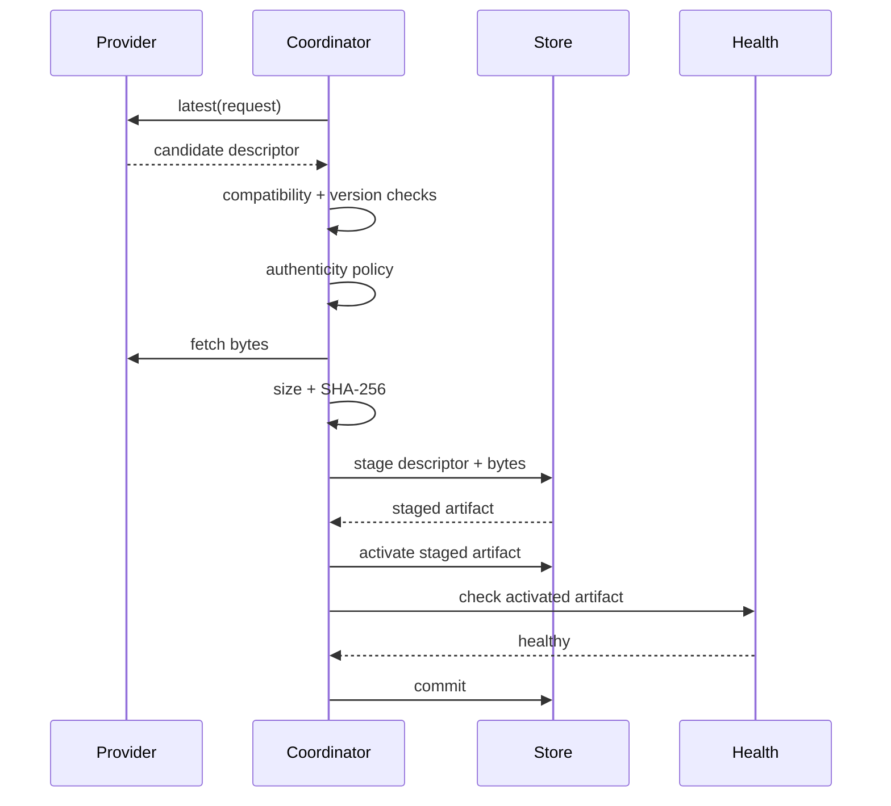

# Updates

Imaginez qu'un opérateur télécharge correctement un update, mais que le nouveau
processus échoue au health probe. Installer définitivement ces bytes
transformerait un deployment récupérable en downtime.

Les updates AppCore traitent les artefacts applicatifs comme des bytes opaques.
Le Runtime valide identité, progression de version, compatibilité,
authenticité, checksum, staging, activation, health et rollback. Il n'inspecte
pas le code applicatif et n'effectue aucune migration de schéma métier.

## Pourquoi un fichier plus récent n'est-il pas automatiquement valide ?

Une requête d'update contient l'identité de l'application installée, sa version
courante et le channel choisi. Le provider peut renvoyer un descriptor candidat.
Le coordinator le rejette lorsque :

- l'application ID diffère ;
- le channel diffère ;
- la version candidate n'avance pas la version installée ;
- l'artefact actif porte un autre application ID ;
- le build ID candidat réutilise le build ID actif ;
- la version candidate n'avance pas la version active ;
- le runtime requirement ou la protocol version est incompatible.

## Qu'est-ce qui prouve qu'un artefact est autorisé ?

Les coordinators de production exigent un verifier explicite d'authenticité.
La vérification Ed25519 emploie les trust roots appartenant au deployment.
Elles peuvent être active, deprecated ou revoked. Une clé revoked rejette tout
artefact.

La policy peut aussi autoriser des channels et origins exacts avant la
vérification de signature. Les artefacts locaux unsigned de développement
exigent une feature de compilation et des contrôles stricts du file root ; ce
n'est jamais un fallback automatique.

Le payload signé couvre les champs stables du descriptor : application ID,
application version, build ID, channel, runtime requirement, protocol version,
artifact reference, SHA-256 et taille.

## Que se passe-t-il entre le download et le commit ?

Le chemin two-phase existe pour vérifier la health au niveau du processus. Un
parent peut préparer et activer un candidat, redémarrer/tester le child, puis
commit ou rollback selon la health observée.

## Quand le rollback intervient-il ?

Si l'activation échoue après l'existence d'un artefact précédent, le
coordinator restaure ce dernier et rapporte le descriptor tenté et la raison.
Des points de fault injection existent après selection, verification, staging,
activation, health verification et avant commit afin que les tests prouvent le
rollback.

## Pourquoi le code d'update tient-il compte du filesystem ?

Les lectures rejettent les symlinks, fichiers non réguliers et fichiers au-delà
de la limite configurée. L'activation revérifie taille et SHA-256 avant
d'installer des artefacts de build immuables. Les paths existants ne sont pas
écrasés, sauf réutilisation idempotente avec des bytes exactement identiques.

## Limites

- Les updates n'effectuent pas automatiquement les migrations de schéma métier.
- Ils ne prouvent pas la correction sémantique de la nouvelle version ; les
  health checks ne testent que le probe configuré.
- Ils ne gèrent pas les credentials externes du deployment.
- La production exige un verifier d'authenticité. Les artefacts locaux unsigned
  sont réservés au développement et aux tests.
- Le rollback couvre l'artifact store et l'activation state ; il n'annule pas
  les effets externes créés par la nouvelle version applicative.

Continuez avec le [modèle de sécurité](/security/security-model).
