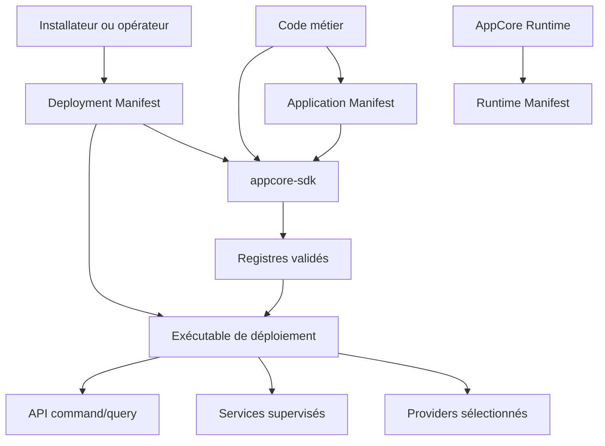
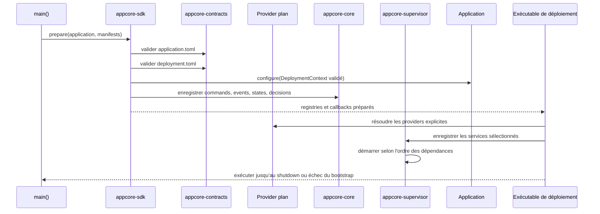

# Ce qu'est AppCore

Imaginez la même application installée dans deux contextes. Dans une boutique, elle tourne sur un notebook et doit continuer sans Internet. Dans une autre installation, elle tourne en cluster avec control plane, leases, Peer RPC et update supervisé. Le code métier ne devrait pas avoir deux architectures.

AppCore existe pour cette frontière.

Ce n'est pas un framework web, une base de données, un ERP ou une plateforme métier. C'est un runtime host qui rend les décisions d'infrastructure explicites, versionnées et testables.

## Le problème

Les backends ordinaires accumulent du comportement Runtime caché :

- configuration mêlant identité, chemins, secrets, réseau et feature toggles ;
- retries dans les handlers plutôt qu'aux frontières de command ;
- jobs en arrière-plan hors supervision du lifecycle ;
- writes et backups implicites dans le client de database choisi ;
- leadership distribué réduit à un booléen plutôt qu'un lease avec fencing ;
- updates remplaçant les fichiers avant que le nouveau processus prouve sa health.

AppCore sépare l'ownership :

| Contrat | Propriétaire | Contient | Ne contient pas |
| --- | --- | --- | --- |
| Application Manifest | application | identité, compatibilité, capabilities, exigences | chemins, provider IDs, endpoints, secrets |
| Deployment Manifest | installation | mode, providers, réseau, chemins, secret refs, watchdog | règles métier, schémas, source |
| Runtime Manifest | runtime | version observée, node/core, health, plateforme | overrides utilisateur |
| Code métier | application | commands, queries, handlers, state, decisions | composition du runtime |

## Ce qui s'exécute au démarrage d'une application AppCore

Le code applicatif utilise `App::prepare` pour valider les manifests et réunir
les enregistrements métier. L'exécutable de déploiement sélectionné possède
ensuite la composition :

Si les deux manifests n'ont pas la même identité, le bootstrap échoue. Une
configuration supprimée s'arrête à l'update wall avec
`NO MORE SUPPORTED PLEASE UPDATE`. Un provider sélectionné mais absent échoue
aussi, sans fallback silencieux.

## Quand l'utiliser

Utilisez AppCore lorsque l'application exige :

- deployments local-first ou cluster ;
- contrats command/query explicites ;
- storage durable et policy de backup ;
- endpoints health et status appartenant au Runtime ;
- services Runtime supervisés ;
- sync avec validation de séquence et checkpoints ;
- Peer RPC ou relay Gateway entre cores ;
- updates avec authenticité, staging, activation, health gate et rollback.

## Quand l'éviter

Évitez-le lorsqu'un serveur HTTP stateless et une base managée suffisent.
AppCore ne fournit volontairement pas :

- ORM général ;
- workflows produit ;
- implémentation OAuth ;
- vault managé de production ;
- terminaison TLS inbound pour tous les deployments ;
- RAFT ou consensus multi-master ;
- résolution automatique des conflits métier.

## Limitations

- AppCore fournit des contrats runtime ; il n'écrit pas le modèle métier.
- Chaque deployment doit encore choisir correctement providers, chemins, secrets et process manager.
- Le runtime valide manifests et enveloppes ; il ne prouve pas que les handlers métier sont corrects.
- La ligne stable 1.0 préfère l'échec explicite à la compatibilité automatique avec les anciens formats.

Ces omissions sont des frontières de design. Elles gardent l'infrastructure
Runtime réutilisable par des applications qui ne partagent pas le même domaine
métier. C'est aussi pourquoi la documentation commence par les manifests et
non par une liste de crates.

## Lire ensuite

Chapitre suivant : [contrat à trois artefacts](/architecture/three-artifact-contract).
