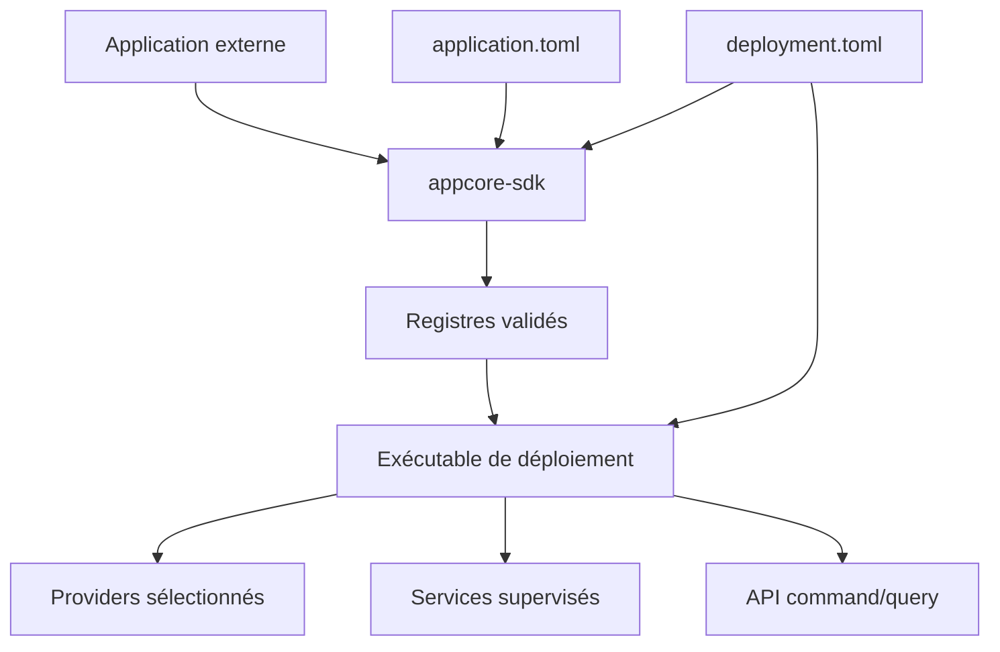
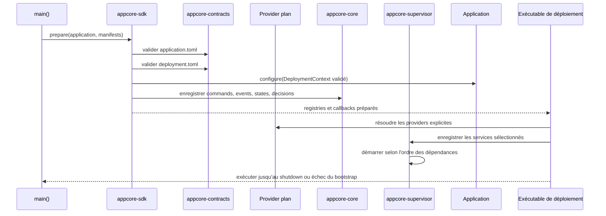

# Ce qu'est AppCore

Imaginez la même application installée dans deux contextes. Dans une boutique, elle tourne sur un notebook et doit continuer sans Internet. Dans une autre installation, elle tourne en cluster avec control plane, leases, Peer RPC et update supervisé. Le code métier ne devrait pas avoir deux architectures.

AppCore existe pour cette frontière.

Ce n'est pas un framework web, une base de données, un ERP ou une plateforme métier. C'est un runtime host qui rend les décisions d'infrastructure explicites, versionnées et testables.

## Le problème

Les backends ordinaires accumulent de l'infrastructure cachée : configuration mélangée avec identité, chemins, secrets et endpoints ; retries dans les handlers ; jobs hors cycle de vie ; update avant preuve de health ; leadership distribué sans fencing.

AppCore sépare l'ownership :

| Contrat | Propriétaire | Contient | Ne contient pas |
| --- | --- | --- | --- |
| Application Manifest | application | identité, compatibilité, capabilities, exigences | chemins, provider IDs, endpoints, secrets |
| Deployment Manifest | installation | mode, providers, réseau, chemins, secret refs, watchdog | règles métier, schémas, source |
| Runtime Manifest | runtime | version observée, node/core, health, plateforme | overrides utilisateur |
| Code métier | application | commands, queries, handlers, state, decisions | composition du runtime |

## Ce qui s'exécute au démarrage d'une application AppCore

Le code applicatif utilise `App::prepare` pour valider les manifests et réunir
les enregistrements métier. L'exécutable de déploiement sélectionné possède
ensuite la composition :

Si les deux manifests n'ont pas la même identité, le bootstrap échoue. Une
configuration supprimée s'arrête à l'update wall avec
`NO MORE SUPPORTED PLEASE UPDATE`. Un provider sélectionné mais absent échoue
aussi, sans fallback silencieux.

## Quand l'utiliser

Utilisez AppCore pour local-first, cluster, commands/queries explicites, storage durable, backup/restore, health/status, services supervisés, sync avec checkpoints, Peer RPC, gateway ou updates avec staging, health gate et rollback.

## Quand l'éviter

Évitez-le lorsqu'un serveur HTTP stateless et une base managée suffisent. AppCore ne fournit pas ORM, OAuth, vault managé, terminaison TLS universelle, RAFT, consensus multi-master ou résolution automatique de conflits métier.

## Limitations

- AppCore fournit des contrats runtime ; il n'écrit pas le modèle métier.
- Chaque deployment doit encore choisir correctement providers, chemins, secrets et process manager.
- Le runtime valide manifests et enveloppes ; il ne prouve pas que les handlers métier sont corrects.
- La ligne stable 1.0 préfère l'échec explicite à la compatibilité automatique avec les anciens formats.

## Lire ensuite

Chapitre suivant : [contrat à trois artefacts](/architecture/three-artifact-contract).
