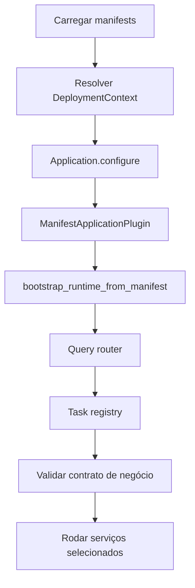

# Bootstrap e runtime host

Bootstrap começa em `run_application`. O host lê `application.toml` e `deployment.toml` ou os overrides `APPCORE_APPLICATION_MANIFEST` e `APPCORE_DEPLOYMENT_MANIFEST`, valida os manifests e cria o `ManifestApplicationHost`.

Essa também é a primeira fronteira de confiança. Antes de existir listener
HTTP, receiver de sync, scheduler ou handler da aplicação, o host decide se a
instalação é coerente o bastante para executar.

## Por que o bootstrap falha cedo?

Os paths são canonicalizados, TOML é parseado para contratos versionados e os dois manifests precisam ter o mesmo `application_id`. Entradas removidas, como `runtime.toml` ou configs antigas com `app_id` sem `manifest_version`, falham com `NO MORE SUPPORTED PLEASE UPDATE`.

Cada arquivo de Application ou Deployment Manifest tem teto de 1 MiB. O host
verifica metadata antes de alocar e lê por `Take(limit + 1)`; arquivo acima do
teto, crescendo durante a leitura ou com UTF-8 inválido falha fechado antes da
composição de providers.

Entradas removidas falham antes de qualquer conversão de compatibilidade.

- arquivo chamado `runtime.toml`;
- input antigo contendo `app_id` sem `manifest_version`.

Falhar cedo impede que uma instalação inválida inicie apenas parte de seus
serviços e termine em um estado mais difícil de diagnosticar.

## Como os manifests se tornam configuração do Runtime?

O Runtime deriva `RuntimeConfig`:

- application ID vira a identidade da aplicação;
- installation ID participa do agrupamento de cluster e sync;
- IDs de node, core e instance são derivados pelo Runtime;
- o listener da API vem do primeiro endereço do deployment;
- cluster mode habilita defaults de sync;
- payloads da API possuem tamanho default limitado;
- TTLs de token e idempotência são policy do Runtime;
- configuração do watchdog vem da policy do deployment.

## O que a aplicação pode configurar?

Commands continuam protegidos pelo manifest. Capability ausente falha. Command que exige idempotency key falha antes do handler se a chave não vier.

O manifest distribuído final produz um único `CapabilityCatalog` no bootstrap.
Facade direta, HTTP da aplicação e Peer RPC usam esse mesmo catálogo para
validar declaração, mode, idempotência, escrita operacional e liderança. Um
`CapabilityRegistry` só existe quando há handler local real; queries de status
do Runtime continuam comportamento explícito do host.

A ordem importa. A aplicação recebe `DeploymentContext` com bindings validados,
não o manifest bruto para conectar providers por conta própria. Ela pode
registrar commands, queries, handlers, states, decisions e tasks, mas não pode
escolher uma capability não declarada depois da validação. O manifest continua
sendo o contrato inspecionável por ferramentas externas.

## Quando os serviços do Runtime iniciam?

O host pode iniciar HTTP, receiver de sync, Peer RPC, worker de control plane,
scheduler, serviço de update e outras infraestruturas conforme o modo e os
requisitos. Esses serviços são registrados no Supervisor, não iniciados como
threads soltas. Um probe de certificação inicia os serviços selecionados,
espera readiness com timeout e encerra tudo de forma cooperativa.

O candidato `appcore-api 1.0.2-rc` também possui uma fronteira opt-in de geração de routing
para o serviço HTTP. Ela prepara e verifica um Router mais novo antes de uma
troca atômica e depois drena requests já admitidos pela geração antiga. Isso não
é um watcher implícito de manifest V1. Veja [reload coordenado](./reload).

## O que shutdown significa?

Shutdown não é matar o processo. O host move o lifecycle pelos estados de
shutdown solicitado e concluído. O encerramento é cooperativo; o Supervisor
pode colocar um serviço que não para em quarantine, mas não pode encerrar com
segurança código arbitrário dentro do processo.

## Limitações

- Bootstrap não infere providers nem aplica fallback silencioso.
- Config antiga sem versão não é convertida.
- Tasks de negócio não são iniciadas fora do scheduler do runtime.
- Commands não declarados no manifest são rejeitados.
- Update automático exige caminho supervisionado; execução direta não gerenciada rejeita esse modo.

Próximo: [storage](/architecture/storage).
