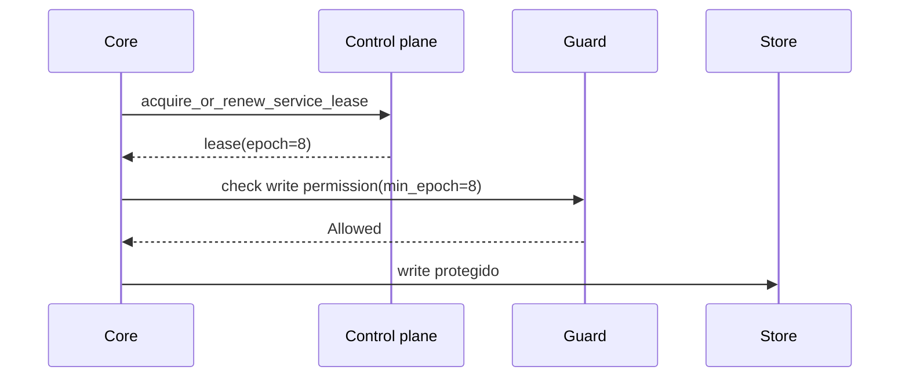

# Operação distribuída

Imagine um core que perdeu rede e acorda atrasado ainda acreditando ser líder. Outro core já renovou o lease. O problema não é ele "achar" que é líder; é impedir que ele ainda consiga gravar.

Distribuição no AppCore combina control plane, leases, discovery, Peer RPC, gateway mesh relay e providers de coordenação explícitos.

## Control plane

O file control plane toma lock, recarrega estado validado e limitado, remove registros expirados, aplica uma operação e persiste atomicamente. O estado tem versão de formato e limite de 16 MiB.

## Leases e fencing

Leadership é por `service_id`. O lease carrega service, tenant, cluster, holder core, expiry e epoch. O epoch é o fencing token.

Um líder antigo falha se lease expirou, holder mudou, tenant/cluster mudou ou o epoch mínimo é mais novo.

## Peer RPC

O envelope valida request ID, trace, protocolo, source/target core, tenant, cluster, timestamp, expiry, nonce, capability, body hash e idempotency key opcional. Nonces podem ser armazenados em memória ou arquivo privado com lock e atomic write.

## Gateway

Gateway existe para cores com conexão outbound mas sem porta inbound estável. Tokens de conexão são curtos, single-use e bound ao hash da conexão. Mesh relay valida que metadata externa combina com o envelope Peer RPC interno. O gateway nunca interpreta payload de negócio.

## Limitations

- O file control plane é referência para diretório compartilhado, não consenso global.
- Leases exigem TTLs e relógios configurados de forma conservadora.
- Peer RPC autentica envelope de runtime; autorização de domínio pertence à aplicação.
- Gateway relaya payload opaco e não resolve conflitos.
- Provider ausente falha startup; AppCore não cai para opção mais fraca.

Próximo: [supervisor](/architecture/supervisor).
