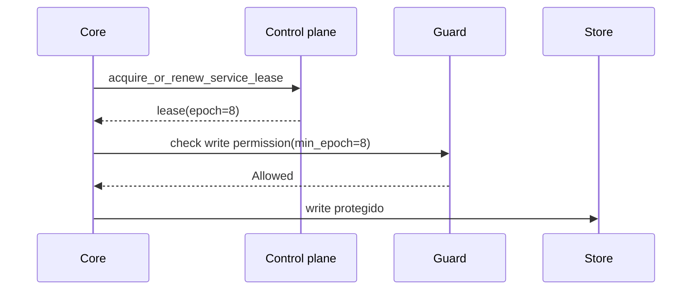

# Operação distribuída

Imagine um core que perdeu rede e acorda atrasado ainda acreditando ser líder. Outro core já renovou o lease. O problema não é ele "achar" que é líder; é impedir que ele ainda consiga gravar.

Distribuição no AppCore combina control plane, leases, discovery, Peer RPC, gateway mesh relay e providers de coordenação explícitos.

## Control plane

O file control plane toma lock, recarrega estado validado e limitado, remove registros expirados, aplica uma operação e persiste atomicamente. O estado tem versão de formato e limite de 16 MiB.

## Leases e fencing

Leadership é por `service_id`. O lease carrega service, tenant, cluster, holder core, expiry e epoch. O epoch é o fencing token.



Um líder antigo falha se lease expirou, holder mudou, tenant/cluster mudou ou o epoch mínimo é mais novo.

## Peer RPC

O envelope valida request ID, trace, protocolo, source/target core, tenant, cluster, timestamp, expiry, nonce, capability, body hash e idempotency key opcional. Nonces podem ser armazenados em memória ou arquivo privado com lock e atomic write.

Rejeições V2 são tipadas e limitadas. Um code fixo determina phase e se uma
operação idempotente de nível superior pode fazer retry; o peer não declara
retryability de forma independente. Metadata desconhecida ou contraditória
falha conservadoramente. V1 mantém o campo string, mas o client reconhece
somente codes controlados exatos e nunca interpreta substrings. Selecionar V2 é
uma decisão coordenada e explícita de deployment; peers V1 não são atualizados
ou redirecionados.

## Gateway

Gateway existe para cores com conexão outbound mas sem porta inbound estável. Tokens de conexão são curtos, single-use e bound ao hash da conexão. Mesh relay valida que metadata externa combina com o envelope Peer RPC interno. O gateway nunca interpreta payload de negócio.

A ativação é declarativa. Ao selecionar o adapter no Deployment Manifest, o
`appcore-bin` valida a configuração, inclui e autoriza `runtime.gateway` no
catálogo compartilhado, reutiliza a segurança do Runtime e registra o Gateway
como serviço crítico do Supervisor:

```toml
[adapters.gateway]
provider_id = "appcore-gateway"
settings = { bind_address = "127.0.0.1:8080", domain_suffix = "gateway.example.com", heartbeat_interval_ms = "30000", heartbeat_timeout_ms = "90000" }
secret_refs = {}
```

Somente essas quatro settings sem segredo são aceitas. Settings desconhecidas,
endpoints, referências de segredo e overrides de autenticação falham fechados.
Sem o adapter não existe listener nem task de Gateway; configuração ou bind
inválido aborta o startup.

O host usa replay store durável e seguro entre processos. Standalone o mantém
no storage privado; cluster exige `paths.gateway_replay` absoluto apontando
para um arquivo gravável e compartilhado por todas as instâncias. Sockets
expiram em até 60 segundos e o shutdown limitado fecha conexões incompletas.

## Limitations

- O file control plane é referência para diretório compartilhado, não consenso global.
- Leases exigem TTLs e relógios configurados de forma conservadora.
- Peer RPC autentica envelope de runtime; autorização de domínio pertence à aplicação.
- Gateway relaya payload opaco e não resolve conflitos.
- Gateway em cluster falha fechado sem replay file compartilhado explícito.
- Provider ausente falha startup; AppCore não cai para opção mais fraca.

Próximo: [supervisor](/architecture/supervisor).
