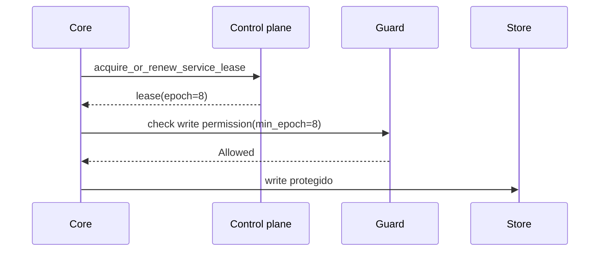

# Operação distribuída

Imagine um core que perdeu rede e acorda atrasado ainda acreditando ser líder. Outro core já renovou o lease. O problema não é ele "achar" que é líder; é impedir que ele ainda consiga gravar.

Distribuição no AppCore combina control plane, leases, discovery, Peer RPC, gateway mesh relay e providers de coordenação explícitos.

Rede privada não é autenticação. Um node ainda valida tenant, cluster,
protocol, target core, nonce, expiry, payload hash e vínculo da credencial.

## Control plane

O file control plane toma lock, recarrega estado validado e limitado, remove registros expirados, aplica uma operação e persiste atomicamente. O estado tem versão de formato e limite de 16 MiB.

Cada operação:

1. toma um file lock do sistema operacional;
2. recarrega estado validado e limitado;
3. remove registros expirados usando o clock autoritativo;
4. aplica exatamente uma operação;
5. persiste atomicamente o estado resultante.

O control plane registra presence, heartbeat, peer discovery e leadership por
serviço. Seu envelope durável possui format version e tamanho máximo; versões
incompatíveis falham na update wall em vez de serem convertidas por tentativa.
Ele responde quem está presente e quem possui um lease, mas não é database de
negócio.

## Leases e fencing

Leadership é por `service_id`. O lease carrega service, tenant, cluster, holder core, expiry e epoch. O epoch é o fencing token.



Um líder antigo falha quando:

- o lease expirou;
- o holder core é diferente;
- tenant ou cluster é diferente;
- o epoch mínimo solicitado é mais novo que o lease atual.

Election escolhe o holder; fencing protege writes após troca de liderança ou
mensagem atrasada. Se um líder antigo acorda com um epoch anterior, o guard
rejeita o commit. Apenas acreditar que uma eleição ocorreu não oferece essa
garantia.

## Por que providers são selecionados explicitamente?

O Deployment Manifest seleciona storage, control plane, coordination store,
secret provider, jobs, discovery, update, database e transports. Factories são
registradas por role e provider ID. Se o par escolhido não existir, a criação
falha; não há fallback de remoto para local, cluster para standalone ou seguro
para inseguro.

## Peer RPC

O envelope vincula:

- request ID;
- trace ID e trace context opcional;
- protocol version;
- source core;
- target core;
- tenant;
- cluster;
- timestamp e expiry;
- nonce;
- capability;
- body hash;
- idempotency key opcional.

O envelope valida request ID, trace, protocolo, source/target core, tenant, cluster, timestamp, expiry, nonce, capability, body hash e idempotency key opcional. Nonces podem ser armazenados em memória ou arquivo privado com lock e atomic write.

A validação limita payload e confere protocol, janela de tempo, consistência do
trace e replay do nonce. O store em arquivo usa JSON limitado, permissões
privadas, locks e substituição atômica. O token peer pode se vincular ao hash
completo do request, impedindo reutilização para outro routing ou body.

Rejeições V2 são tipadas e limitadas. Um code fixo determina phase e se uma
operação idempotente de nível superior pode fazer retry; o peer não declara
retryability de forma independente. Metadata desconhecida ou contraditória
falha conservadoramente. V1 mantém o campo string, mas o client reconhece
somente codes controlados exatos e nunca interpreta substrings. Selecionar V2 é
uma decisão coordenada e explícita de deployment; peers V1 não são atualizados
ou redirecionados.

## Gateway

Gateway existe para cores com conexão outbound mas sem porta inbound estável. Tokens de conexão são curtos, single-use e bound ao hash da conexão. Mesh relay valida que metadata externa combina com o envelope Peer RPC interno. O gateway nunca interpreta payload de negócio.

A ativação é declarativa. Ao selecionar o adapter no Deployment Manifest, o
executável de deployment valida a configuração, inclui e autoriza `runtime.gateway` no
catálogo compartilhado, reutiliza a segurança do Runtime e registra o Gateway
como serviço crítico do Supervisor:

```toml
[adapters.gateway]
provider_id = "appcore-gateway"
settings = { bind_address = "127.0.0.1:8080", domain_suffix = "gateway.example.com", heartbeat_interval_ms = "30000", heartbeat_timeout_ms = "90000" }
secret_refs = {}
```

Somente essas quatro settings sem segredo são aceitas. Settings desconhecidas,
endpoints, referências de segredo e overrides de autenticação falham fechados.
Sem o adapter não existe listener nem task de Gateway; configuração ou bind
inválido aborta o startup.


Tokens de worker e client têm vida curta, uso único e hash vinculado. O hash do
worker inclui tenant, cluster, installation, core e capabilities; o do client
inclui tenant, cluster e device. O relay confirma que a metadata externa combina
com o envelope Peer RPC e limita mensagens, timeouts e filas sem interpretar o
payload opaco.

O host usa replay store durável e seguro entre processos. Standalone o mantém
no storage privado; cluster exige `paths.gateway_replay` absoluto apontando
para um arquivo gravável e compartilhado por todas as instâncias. Sockets
expiram em até 60 segundos e o shutdown limitado fecha conexões incompletas.

## Limitations

- O file control plane é referência para diretório compartilhado, não consenso global.
- Leases exigem TTLs e relógios configurados de forma conservadora.
- Peer RPC autentica envelope de runtime; autorização de domínio pertence à aplicação.
- Gateway relaya payload opaco e não resolve conflitos.
- Gateway em cluster falha fechado sem replay file compartilhado explícito.
- Provider ausente falha startup; AppCore não cai para opção mais fraca.

Próximo: [supervisor](/pt/architecture/supervisor).
