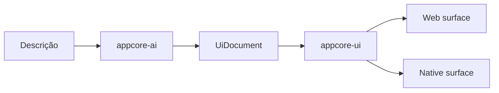
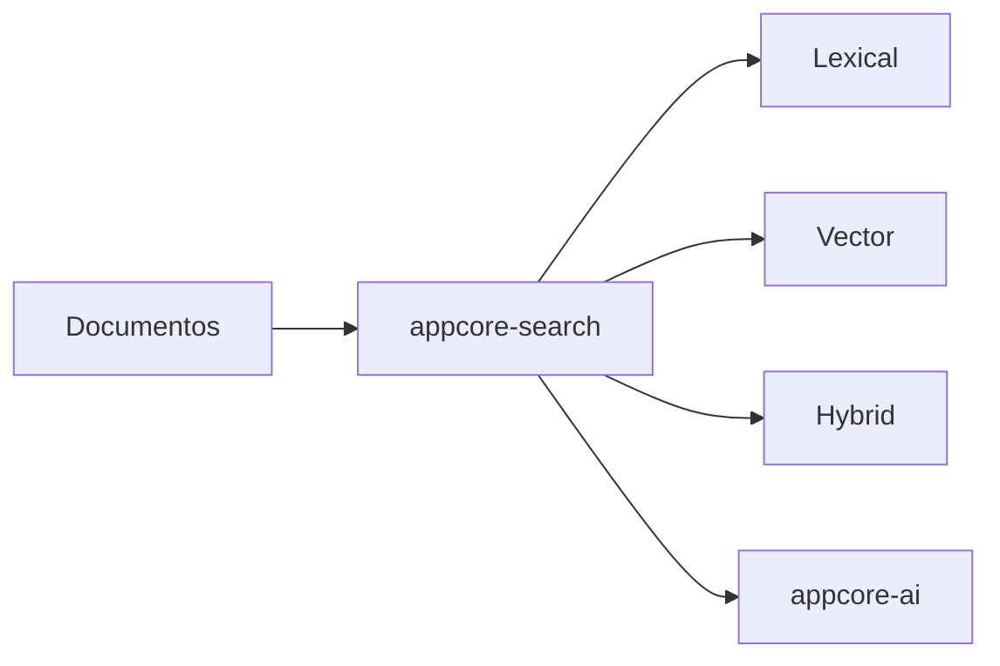
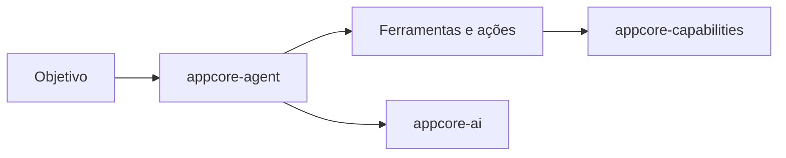
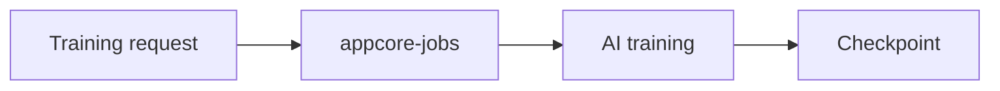
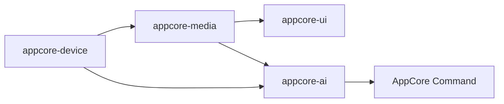
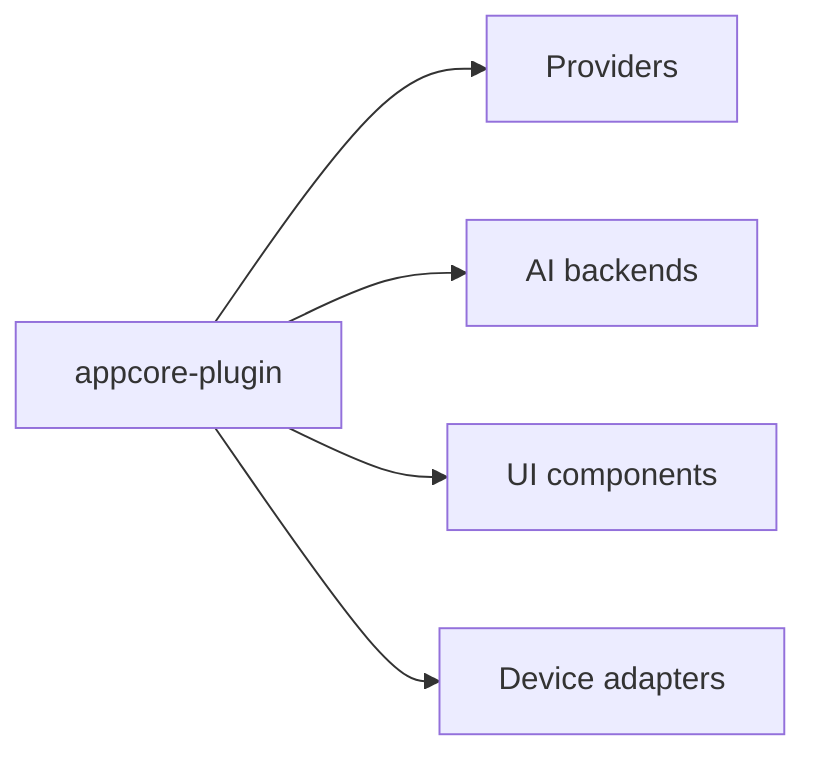

# Arquitetura futura

:::caution Roadmap conceitual
Esta página descreve ideias de arquitetura futura. Ela **não** altera a
arquitetura atual do Runtime nem o catálogo atual de crates públicos.
:::

Trabalho futuro no AppCore segue a mesma regra do Runtime atual: uma crate só
existe quando possui dono claro, consumidores, fronteira de dependências,
testes, caminho de publicação e documentação.

## Fluxos Conceituais

Automação determinística e agentes adaptativos permanecem separados.
Automação é `Event -> Condition -> Action -> Command`. Agentes lidam com
objetivos, planejamento, ferramentas, memória e propostas de ação por IA e
capabilities.

Training, se suportado, deve ser explícito:

Media e devices também são fronteiras:

Plugins compõem pontos de extensão:

## Perfis

- aplicação desktop;
- aplicação desktop com IA;
- backend distribuído;
- instalação edge ou IoT;
- aplicação de mídia;
- plataforma de agentes;
- ferramenta visual de desenvolvimento.

## Não Objetivos

AppCore não pretende virar:

- sistema operacional;
- database universal;
- browser engine;
- framework completo de machine learning;
- graphics engine reinventado;
- stack criptográfica própria;
- cloud provider;
- monólito.

## Princípios

- Preferir standard library Rust ou crates internos antes de dependências externas.
- Manter comportamento local-first possível.
- Usar distribuição apenas quando o deployment precisa.
- Rotear extensões por capabilities e providers explícitos.
- Manter features pesadas opt-in.
- Não deixar detalhes de implementação vazarem na API central.
- Exigir dono, consumidores, posição no DAG, testes, publicação e docs antes de criar uma crate.

## Maturidade

Research significa que a fronteira ainda está sob investigação. Planned reserva
uma fronteira útil. In Design indica que a forma pública está sendo desenhada.
Alpha, Beta e RC indicam confiança crescente de implementação e release. Stable
significa crate publicada com contrato SemVer próprio.
