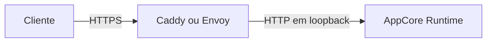

# Sidecar TLS de entrada

TLS de entrada pertence ao boundary do deployment. O AppCore escuta apenas em
HTTP loopback; Caddy ou Envoy possui o socket TLS público, certificados, health
checks e forwarding. O Runtime nunca lê a chave privada nem expõe fallback
cleartext.

O source pós-1.0 fornece perfis Caddy 2.11.4 para systemd, launchd e
Windows/WinSW, e Envoy 1.39.0 para systemd. Isto é desenvolvimento, não parte da
superfície estável 1.0.

## Forma obrigatória do deployment

- Ligue o Runtime a `127.0.0.1:<porta>` e negue acesso remoto no firewall.
- Exponha o sidecar somente com TLS; mantenha o admin em loopback.
- Proteja os caminhos de certificado/chave; nunca grave bytes da chave em manifests, argumentos ou logs.
- Inicie Runtime e depois sidecar. Publique somente após `/v1/health` via HTTPS passar com hostname e cadeia validados.
- Readiness é o health HTTPS externo; liveness e health loopback são sinais de diagnóstico.

Os templates ficam em `packaging/tls-sidecar` na fonte beta privada.
`appcore-dev service check` bloqueia a remoção do upstream loopback, entradas
TLS, health limitado, limites de capacidade ou hardening do serviço. O Envoy
usa o recurso filesystem-SDS separado `envoy/tls-secret.yaml`; um certificado
estático em `CommonTlsContext` não faz hot reload.

## Rotação e rollback

Valide o par completo em novo caminho owner-only e publique-o atomicamente.
Caddy valida e recarrega o candidato; o Envoy observa via filesystem SDS a
troca atômica do symlink de um diretório versionado. Preserve o par anterior
até o health HTTPS confirmar o novo certificado.

Falha mantém ou restaura o par anterior. Se o sidecar parar, o endpoint público
fica indisponível e a porta Runtime continua inacessível. Se o Runtime parar, o
sidecar marca o upstream unhealthy sem usar destino alternativo ou cleartext.

Rotação não exige trocar a routing generation AppCore: requests aceitas ficam
no sidecar e o listener Runtime permanece estável. Troca de endereço pertence
ao routing externo do deployment.

## Certificação do repositório e limites

Execute `appcore-dev cert tls-sidecar` para certificar os dois perfis em Docker
Linux e gravar `builds/certification/tls-sidecar.json`. O gate usa hostname e
cadeia confiados localmente e verifica readiness HTTPS, bloqueio cleartext, 512
requests aceitas durante a rotação, troca de serial, rollback de candidato
inválido, restart do sidecar e falha fechada quando o Runtime desaparece. O
Envoy também limita globalmente a 1.024 conexões downstream.

Isto conclui o perfil AC-024 que pertence ao repositório, sem certificar um
host de produção. AC-010 acompanha service managers Windows/Unix reais,
firewalls do host, expiração/revogação de certificados de produção, soak de
cluster por 24 horas e revisão de segurança independente. A certificação de
segredos em repouso no Windows também depende de AC-009.

Continue em [reload HTTP coordenado](./reload).
