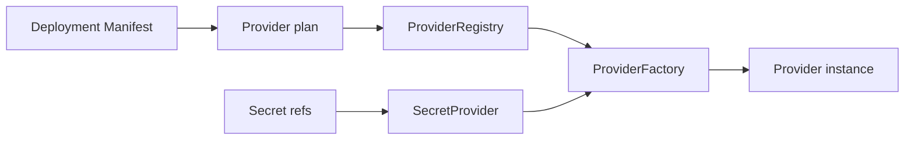

# Providers

A mesma aplicação pode rodar no laptop de desenvolvimento, no notebook de uma loja ou em cluster. Se a escolha de infraestrutura ficar no código de negócio, cada instalação vira um build diferente.

Providers são a fronteira de instalação. O deployment escolhe infraestrutura sem alterar o artefato da aplicação.

## O que o deployment escolhe?

`DeploymentProviderPlan` extrai:

- storage;
- control plane;
- coordination store;
- secret provider;
- job provider;
- peer discovery;
- update provider;
- database provider;
- peer transport;
- command transport;
- adapters nomeados.

O contexto contém somente application ID, installation ID e modo do Runtime,
nunca secrets.

## Por que não existe fallback implícito?

Factory é registrada por role e provider ID. Se o par selecionado não existe, creation falha. Não há fallback implícito.

Isso é intencional: um fallback mudaria as garantias de segurança e recovery do
deployment sem alterar sua configuração declarada.

A seleção de storage também executa preflight explícito de capacidades
pós-1.0. Um descriptor limitado declara garantias exatas em vez de nomes de
implementação; o provider selecionado deve satisfazer todos os requisitos antes
de abrir. Veja [preflight de capacidades de storage](/architecture/storage-provider-capabilities).

## Para que serve o coordination store?

O coordination store possui metadata de schema do Runtime, incluindo o arquivo
versionado `coordination-schema.meta`. Ele migra versões anteriores e rejeita
versões futuras incompatíveis. Não é banco de negócio.

## Por que manifests guardam referências de secrets?

O secret provider resolve referências como `env:APPCORE_EXAMPLE_SECRET` depois
da validação, mantendo valores fora dos manifests e da aplicação.

## O que um lease em filesystem comprova?

O lease de recurso compartilhado em filesystem persiste um sidecar versionado
com o maior epoch antes de publicar o lease ativo. Release, restart e aquisição
interrompida não reutilizam epochs. O epoch só funciona como fencing token se
todo writer protegido o comparar antes da escrita; filesystems sem lock,
rename, sync de diretório e coerência de cache confiáveis não evitam split-brain
sozinhos.

## O que um provider de produção deve documentar?

- limites de timeout, retry, fila e payload;
- autenticação e ownership de secrets;
- health e comportamento de degradação;
- garantias de persistência e recuperação;
- policy de migração e compatibilidade;
- diagnósticos redacted;
- testes de conformidade e falha.

## Limitações

- Providers não tornam standalone e cluster equivalentes; cada modo tem requisitos próprios.
- Provider selecionado e ausente falha creation em vez de fallback.
- Secret provider resolve referências, mas AppCore não fornece vault gerenciado.
- Coordination store é infraestrutura do runtime, não database de aplicação.
- Health de provider indica disponibilidade de infraestrutura, não correção de negócio.

Próximo: [primeira aplicação](/tutorials/first-application).
