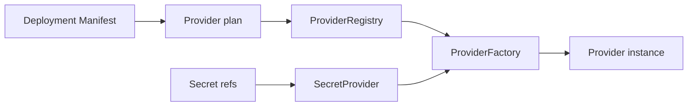

# Providers

A mesma aplicação pode rodar no laptop de desenvolvimento, no notebook de uma loja ou em cluster. Se a escolha de infraestrutura ficar no código de negócio, cada instalação vira um build diferente.

Providers são a fronteira de instalação. O deployment escolhe infraestrutura sem alterar o artefato da aplicação.

`DeploymentProviderPlan` extrai storage, control plane, coordination store, secret provider, jobs, discovery, update, database, peer transport, command transport e adapters.

Factory é registrada por role e provider ID. Se o par selecionado não existe, creation falha. Não há fallback implícito.

Provider de coordenação é runtime-owned e não banco de negócio. Secret provider resolve referências depois da validação, mantendo valores fora dos manifests.

## Limitations

- Providers não tornam standalone e cluster equivalentes; cada modo tem requisitos próprios.
- Provider selecionado e ausente falha creation em vez de fallback.
- Secret provider resolve referências, mas AppCore não fornece vault gerenciado.
- Coordination store é infraestrutura do runtime, não database de aplicação.
- Health de provider indica disponibilidade de infraestrutura, não correção de negócio.

Próximo: [primeira aplicação](/tutorials/first-application).
