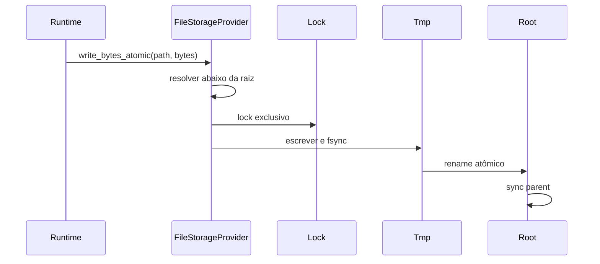
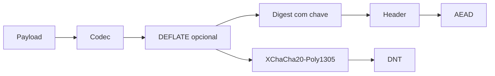

# Storage, DNT, backup e restore

Imagine uma loja gravando um orçamento quando o notebook desliga por falta de bateria. No próximo boot, o operador não deveria precisar adivinhar se o arquivo ficou meio antigo e meio novo.

Esse é o problema de storage que o AppCore resolve. Storage no AppCore não é ORM. É a fronteira de runtime para arquivos duráveis, backup, restore, objetos DNT, leituras autenticadas e health do provider.

## Por que não escrever direto no arquivo final?

Porque uma interrupção durante write pode deixar estado ambíguo. Log de sync, nonce store, backup manifest e objeto DNT precisam ser completos ou rejeitados.

O file provider segue um protocolo pequeno:

1. resolve o path abaixo da raiz configurada;
2. rejeita path absoluto, `..`, prefix e symlink;
3. toma lock quando a operação precisa de consistência;
4. grava em arquivo temporário;
5. chama `sync_all`;
6. troca com rename atômico;
7. sincroniza o diretório pai quando o sistema suporta.

## Por que leituras têm limite?

Alguns formatos precisam ser lidos inteiros para validação: DNT, checkpoint, backup manifest, update artifact, nonce store e estado do control plane. AppCore rejeita arquivo grande antes de alocar memória sem bound.

## O que acontece num backup snapshot?

Backup snapshot usa formato `appcore-storage-backup-v1`, inventário ordenado, tamanho e SHA-256 por arquivo. A criação é staged em diretório temporário e só depois renomeada para o backup final.

O diretório final só aparece quando o manifest e os arquivos copiados concordam. Restore não confia só na listagem do diretório; ele verifica inventário, tamanhos e hashes.

## Como restore se recupera de crash?

Restore copia backup verificado para `restore.pending`, move storage atual para `restore.previous`, ativa pending como storage root e remove previous. Se o processo morre no meio, `recover_snapshot_restore` escolhe pending/previous/current sem descartar a última raiz boa.

## Por que DNT autentica metadata?

DNT é um envelope binário autenticado e cifrado. Extensões são convenções; o header é a identidade. O header inclui application ID, tenant opcional, content type, codec, key ID, schema version, nonce, payload hash e metadata. Ele é AEAD additional data, então alterar contexto quebra autenticação.

`read_verified` exige limite de payload, rejeita arquivos grandes antes de carregar tudo e usa `open_owned` para autenticar e abrir. Plaintext retornado pode ser zeroizado.

## Limitations

- O file provider não é banco distribuído multi-writer.
- AppCore não compensa filesystem que não honra locks, flush ou rename atômico.
- Backup cobre a raiz de storage do runtime, não bancos externos ou efeitos colaterais de negócio.
- DNT protege bytes e contexto autenticado; não define autorização de domínio.
- Restore não desfaz ações externas executadas por handlers da aplicação.

Próximo: [sync](/architecture/synchronization).
