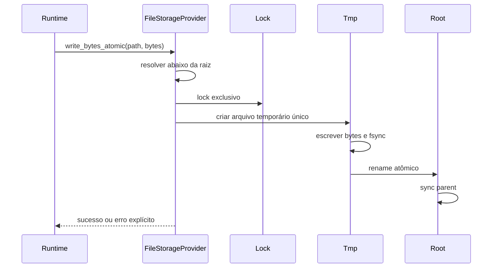
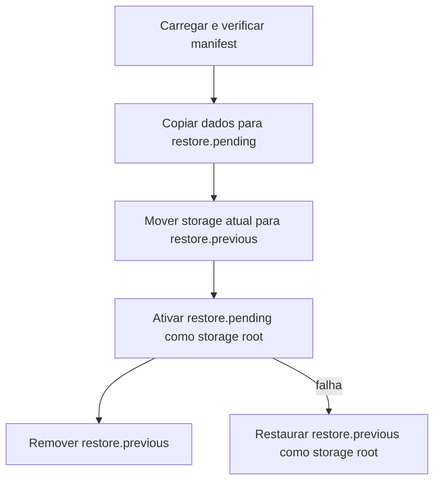
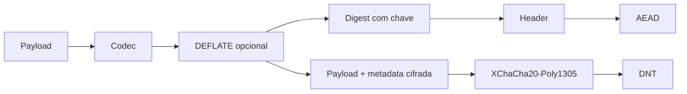

# Storage, DNT, backup e restore

Imagine uma loja gravando um orçamento quando o notebook desliga por falta de bateria. No próximo boot, o operador não deveria precisar adivinhar se o arquivo ficou meio antigo e meio novo.

Esse é o problema de storage que o AppCore resolve. Storage no AppCore não é ORM. É a fronteira de runtime para arquivos duráveis, backup, restore, objetos DNT, leituras autenticadas e health do provider.

O provider de referência usa arquivos locais. Seu comportamento é
deliberadamente conservador porque também guarda estado do Runtime, como logs,
snapshots, bundles de backup, nonce stores e metadata de coordenação.

## Por que não escrever direto no arquivo final?

Porque uma interrupção durante write pode deixar estado ambíguo. Log de sync, nonce store, backup manifest e objeto DNT precisam ser completos ou rejeitados.

O file provider segue um protocolo pequeno:

1. resolve o path abaixo da raiz configurada;
2. rejeita path absoluto, `..`, prefix e symlink;
3. toma lock quando a operação precisa de consistência;
4. grava em arquivo temporário;
5. chama `sync_all`;
6. troca com rename atômico;
7. sincroniza o diretório pai quando o sistema suporta.

O baseline local oferece:

- paths resolvidos abaixo das roots configuradas;
- rejeição de paths absolutos, traversal, prefixes e symlinks;
- arquivos temporários, `sync_all`, rename atômico e sync do parent;
- file lock do sistema operacional para operações consistentes;
- falha explícita para transactions não suportadas.

Nenhum filesystem é perfeito. O objetivo é usar o padrão portátil mais forte
que o AppCore consegue verificar e retornar um erro explícito quando uma das
garantias de lock, flush ou rename não estiver disponível.

## Por que leituras têm limite?

Alguns formatos precisam ser lidos inteiros para validação: DNT, checkpoint, backup manifest, update artifact, nonce store e estado do control plane. AppCore rejeita arquivo grande antes de alocar memória sem bound.

Esse princípio também cobre logs de sync, objetos DNT, manifests de backup,
artefatos de update, stores de nonce e estado do control plane. Todos possuem
tetos explícitos de bytes porque arquivos locais podem estar corrompidos ou ser
hostis. Uma leitura completa nunca significa uma alocação sem limite.

Housekeeping e traversal de backup são iterativos e limitados; nunca seguem
symlinks nem reparse points do Windows. A abertura final usa no-follow da
plataforma e é revalidada com o lock do processo. Listagens de backup preferem
o timestamp persistido no manifest do snapshot.

## O que acontece num backup snapshot?

Backup snapshot usa formato `appcore-storage-backup-v1`, inventário ordenado, tamanho e SHA-256 por arquivo. A criação é staged em diretório temporário e só depois renomeada para o backup final.

O manifest contém:

- marcador `appcore-storage-backup-v1`;
- nome do backup;
- creation time;
- inventário ordenado de arquivos;
- tamanho de cada arquivo;
- SHA-256 de cada arquivo.

O diretório final só aparece quando o manifest e os arquivos copiados concordam. Restore não confia só na listagem do diretório; ele verifica inventário, tamanhos e hashes.

A criação copia apenas arquivos regulares, sincroniza conteúdo e diretórios e
rejeita nomes de backup existentes e symlinks. A quantidade de arquivos e o
tamanho do manifest são limitados. O manifest é o ponto de auditoria: restore
valida o inventário declarado antes de qualquer activation.

## Como restore se recupera de crash?

Restore copia backup verificado para `restore.pending`, move storage atual para `restore.previous`, ativa pending como storage root e remove previous. Se o processo morre no meio, `recover_snapshot_restore` escolhe pending/previous/current sem descartar a última raiz boa.

Restore é mais difícil porque durante a troca existem duas verdades: a root
antiga e o candidato verificado. Por isso os estados usam nomes fixos visíveis,
em vez de estado escondido. Na recuperação, pending é usado quando não existe
root atual; previous é usado quando é a última cópia boa; e previous é removido
quando a root atual já foi ativada com sucesso.

## Por que DNT autentica metadata?

DNT é um envelope binário autenticado e cifrado. Extensões são convenções; o header é a identidade. O header inclui application ID, tenant opcional, content type, codec, key ID, schema version, nonce, payload hash e metadata. Ele é AEAD additional data, então alterar contexto quebra autenticação.

O envelope contém:

- magic bytes `APDNT`;
- envelope version;
- flags;
- algorithm ID;
- application ID;
- tenant ID opcional;
- content type lógico;
- codec ID;
- key ID;
- schema version;
- creation time;
- payload length;
- nonce XChaCha20-Poly1305;
- hash do payload com chave;
- metadata pública autenticada;
- tamanho da metadata cifrada;
- ciphertext.

`read_verified` exige limite de payload, rejeita arquivos grandes antes de carregar tudo e usa `open_owned` para autenticar e abrir. Plaintext retornado pode ser zeroizado.

O header completo participa como additional data do AEAD. Portanto application
ID, tenant, content type, codec, schema, key e metadata não podem ser alterados
sem falha de autenticação. `open_owned` descriptografa in-place depois que o
buffer limitado pertence ao caller; `zeroize_plaintext` apaga o conteúdo
devolvido quando ele deixa de ser necessário.

## Quais são os trade-offs deste modelo de storage?

O file provider é simples e inspecionável, mas não é um banco distribuído
multi-writer. O perfil local espera um processo e um filesystem que honre
locks, sync e rename atômico. Coordenação de cluster usa providers explícitos.
Isso preserva instalações local-first pequenas sem fingir que um diretório
compartilhado é um database geral.

Exigir um database em toda instalação simplificaria concorrência em cluster,
mas enfraqueceria o perfil offline e tornaria muito mais pesada a menor
instalação válida. O AppCore prefere um provider local conservador e torna a
coordenação distribuída uma escolha explícita.

## Limitações

- O file provider não é banco distribuído multi-writer.
- AppCore não compensa filesystem que não honra locks, flush ou rename atômico.
- O perfil de um processo pressupõe uma raiz protegida pelo proprietário; um
  processo hostil da mesma conta trocando um diretório ancestral durante a
  operação fica fora desta fronteira portátil.
- Backup cobre a raiz de storage do runtime, não bancos externos ou efeitos colaterais de negócio.
- DNT protege bytes e contexto autenticado; não define autorização de domínio.
- Restore não desfaz ações externas executadas por handlers da aplicação.

Próximo: [sync](/architecture/synchronization).
