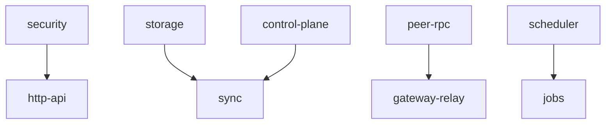
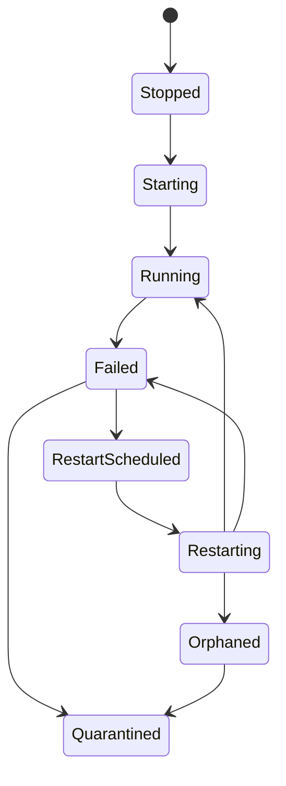

# Supervisor e ciclo de vida

Suponha que o receiver de sync inicie antes de o storage estar saudável. Ou
que um worker do gateway falhe repetidamente e cada falha crie outra tentativa
de restart. Um runtime sem supervisão transforma esses casos em comportamento
oculto em background.

`appcore-supervisor` é a orquestração local de serviços do processo. Ele inicia
e encerra serviços pertencentes ao Runtime, verifica dependências, acompanha
health, agenda restarts limitados, emite eventos e expõe diagnósticos.

Ele não reinicia o processo AppCore. Isso continua sendo responsabilidade de
systemd, launchd, Windows Service Control Manager, um runtime de containers ou
outro process manager.

## O que é um serviço gerenciado?

Cada serviço fornece um descriptor:

- nome estável do serviço;
- tipo de recurso gerenciado;
- dependências;
- política de restart;
- estado de ativação;
- indicação de falha crítica.

Os nomes são limitados e restritos a caracteres ASCII alfanuméricos mais `.`,
`-` e `_`. Um serviço não pode depender de si mesmo. A validação das
dependências e a ordenação topológica acontecem antes de `start_all`.

## Como o startup evita races entre dependências?

O supervisor inicia os serviços habilitados na ordem das dependências. Antes
de iniciar um serviço, verifica o health das dependências contra o requisito
declarado. Uma dependência ausente ou insuficiente degrada os dependentes em
vez de iniciar uma tempestade de restarts.

## Por que restarts são agendados em vez de imediatos?

O restart é agendado, não executado inline. O supervisor:

1. verifica se o restart é permitido e ainda não está ativo;
2. consome o orçamento de restart dentro da janela configurada;
3. adiciona backoff e jitter;
4. marca o serviço como agendado;
5. envia o comando ao executor limitado quando chega o momento;
6. aplica o estado de conclusão.

Se a fila estiver cheia, o sistema não cria trabalho ilimitado. Se o orçamento
se esgotar, o serviço é colocado em quarantine e exige ação do operador.

## O que acontece quando o shutdown não prova que um worker parou?

Shutdown é cooperativo. Se um serviço não puder ser encerrado com segurança e
um restart deixaria um worker desconhecido para trás, o supervisor registra o
serviço como orphaned e quarantined. Ele emite ambos os eventos. Isso é mais
seguro do que fingir que o worker antigo desapareceu.

## O que o watchdog comprova?

O watchdog permite que consumidores de health diferenciem um runtime responsivo
de um runtime travado. A política do deployment controla o intervalo de checks
e o timeout de stall. O watchdog não supervisiona o processo; ele é um sinal
interno que um process manager ou operador pode usar.

## Por que isso fica fora de `appcore-core`?

O core possui dispatch de commands, registries, audit e estado de lifecycle. O
supervisor possui a orquestração de serviços. A separação impede o dispatch de
depender da implementação de restart e permite que serviços de infraestrutura
compartilhem um único modelo de lifecycle.

O owner de routing HTTP coordenado continua sendo o serviço gerenciado `http`
existente. Suas gerações internas não registram outro Supervisor nem reiniciam
o processo. Veja [reload coordenado](./reload).

## Limitações

- O supervisor não reinicia o processo; gerencia apenas serviços dentro dele.
- Shutdown é cooperativo; AppCore não pode encerrar com segurança código
  arbitrário dentro do processo.
- Orçamentos de restart evitam storms, portanto um serviço que falha
  repetidamente pode permanecer em quarantine até a ação de um operador.
- Health checks descrevem o health dos serviços, não a correção de negócio
  ponta a ponta.
- A ordem de dependências evita races conhecidas, mas não torna saudável uma
  dependência unhealthy.

Continue com [updates](/architecture/updates).
