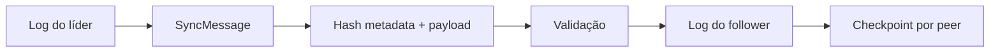

# Sync, logs, checkpoints e replay

Imagine uma loja sem internet por oito horas. O operador continua emitindo orçamentos. Quando a rede volta, o runtime precisa saber o que já foi enviado, o que é novo, o que é retry e o que é conflito.

Sync no AppCore é replicação conservadora leader-to-follower. Não é RAFT, multi-master nem resolvedor de conflitos de domínio.

## O que acontece quando a loja reconecta?

Commands locais podem continuar conforme a política de storage e command. Quando a rede volta, o receiver não confia no batch: valida identidade, protocolo, sequência, count, tamanho, hash, previous hash e checkpoint.

Se a mesma sequência reaparece com o mesmo payload, é retry. Se a mesma sequência reaparece com bytes diferentes, não é retry: é conflito.

## O que um SyncMessage prova?

Um batch carrega `batch_id`, source node, `sequence_start`, `sequence_end`, event count, hash dos eventos, timestamp, previous batch hash e payloads opacos.

O hash cobre metadata e tamanho dos payloads, não apenas os bytes soltos. Isso impede aceitar o mesmo payload com metadata de sequência diferente.

## Por que manter replication log?

O log file-backed usa marcador `# appcore-replication-log-v1`, limite total, limite por record, sequence map, hash chain, lock e atomic write. Append por sequência é idempotente: mesma sequência e mesmo payload retorna o índice original; mesma sequência e payload diferente é conflito.

O log é evidência de replay. Sem log, recovery teria que confiar em projections de aplicação, que podem ter sido compactadas, migradas ou parcialmente reconstruídas.

## Por que checkpoint existe se já existe replay?

Checkpoint guarda última sequência aceita e batch hash por peer em formato `# appcore-sync-checkpoint-v1`. Peer IDs e hashes são validados e o arquivo é substituído atomicamente.

Sem checkpoint, recovery teria que replayar tudo ou inferir progresso pela projection. AppCore não faz essa inferência.

## Como a outbox durável faz recovery?

A outbox file-backed do próximo major usa o marcador binário explícito
`appcore-sync-outbox-v2`. Cada enqueue ou ACK acrescenta e sincroniza um frame
limitado. Ordinais, comprimentos no início/fim e uma cadeia SHA-256 detectam
corrupção, duplicação e reordenação. Somente um frame final incompleto é
truncado após crash; um frame completo inválido falha fechado.

Espaço confirmado é recuperado por compactação atômica, que grava apenas
mensagens pendentes e muda a geração. Outro processo com visão antiga detecta a
mudança e recarrega. O journal continua limitado a 64 MiB e reserva tail
suficiente para confirmar a mensagem frontal já aceita.

Essa é uma fronteira explícita de formato persistente. Arquivos V1, sem versão
ou futuros retornam `NO MORE SUPPORTED PLEASE UPDATE`; o Runtime não infere nem
converte. Operadores drenam V1 antes do upgrade e V2 antes do rollback.

## Onde entra idempotency?

Idempotency de command e idempotency de batch resolvem problemas diferentes. A key de command evita duplicar retry de cliente. A sequência/checkpoint evita duplicar replicação entre peers. Os dois limites precisam existir porque os retries acontecem em fronteiras diferentes.

## Persistência SQLite opcional depois do 1.0

A prévia pós-1.0 publicada `appcore-sync-sqlite 0.1.0-alpha.2` persiste apenas registros de sync do
Runtime: replication log, outbox, checkpoints por peer e tombstones opacos. Ela
usa schema interno versionado, WAL, sincronização completa, conexões e limites
explícitos, snapshots portáveis, backup online verificado e integrity scan que
falha fechado. Ela nunca expõe SQL arbitrário nem tabelas de aplicação.

O provider suporta processos locais independentes em filesystem com locking
confiável. Shares de rede, SQLite multi-host e seleção automática pelo manifest
V1 congelado estão fora do contrato. Schemas internos desconhecidos ou futuros
retornam `NO MORE SUPPORTED PLEASE UPDATE`; formatos file-provider não são
importados por inferência. Veja a
[prévia `appcore-sync-sqlite`](../crates/appcore-sync-sqlite).

## Limitations

- Sync é leader-to-follower, não RAFT nem multi-master.
- AppCore detecta conflito de sequência/hash, mas não mescla alterações de negócio.
- Checkpoint prova progresso aceito pelo runtime, não correção de projection.
- Replay depende de handlers respeitarem idempotency.
- Outboxes file V1 e V2 não são mutuamente legíveis; upgrade e rollback exigem
  fila durável vazia.
- Partições de rede são tratadas de forma conservadora; writes que exigem liderança não prometem disponibilidade global contínua.

Próximo: [operação distribuída](/architecture/distributed).
