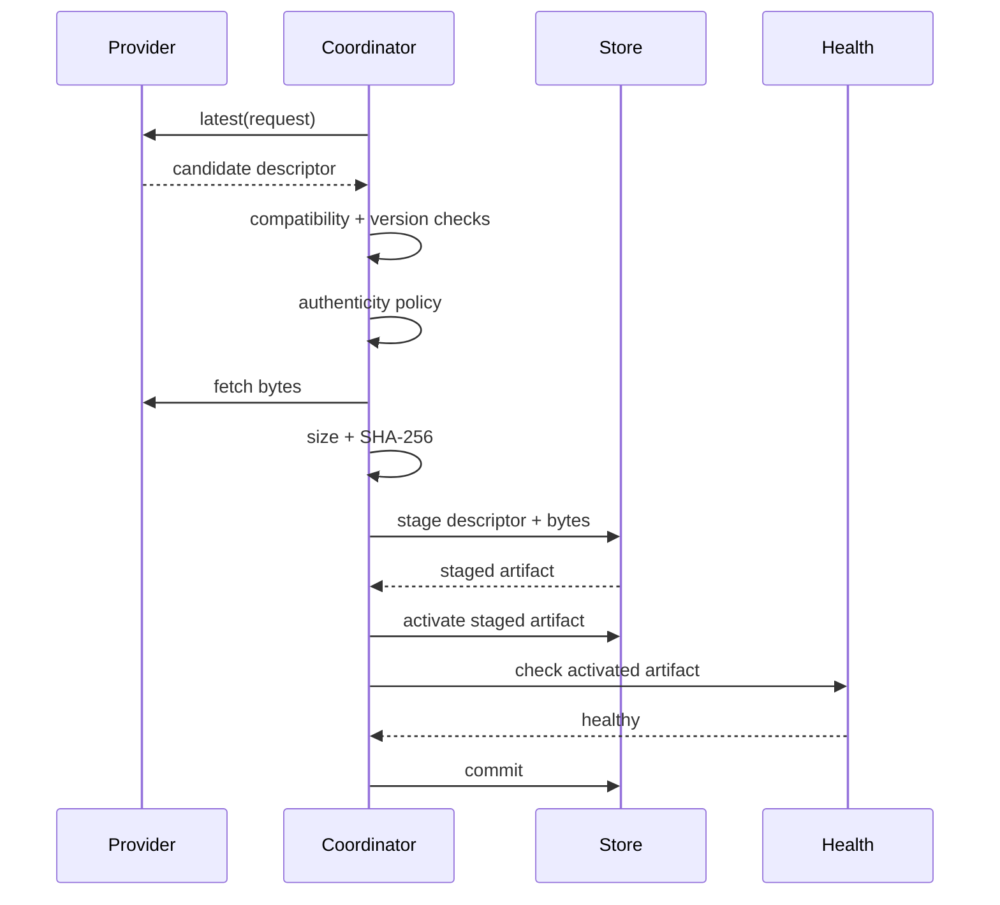

# Updates

Imagine que um operador baixe um update corretamente, mas o novo processo não
passe no health probe. Instalar esses bytes de forma permanente transformaria
um deployment recuperável em downtime.

Updates do AppCore tratam artefatos de aplicação como bytes opacos. O Runtime
valida identidade, avanço de versão, compatibilidade, autenticidade, checksum,
staging, activation, health e rollback. Ele não inspeciona o código da
aplicação nem executa migração de schema de domínio.

## Por que um arquivo mais novo não é automaticamente um update válido?

Uma solicitação de update contém a identidade da aplicação instalada, versão
atual e channel selecionado. O provider pode retornar um descriptor candidato.
O coordinator rejeita o candidato quando:

- o application ID é diferente;
- o channel é diferente;
- a versão candidata não avança a versão instalada;
- o artefato ativo tem outro application ID;
- o build ID candidato reutiliza o build ID ativo;
- a versão candidata não avança a versão ativa;
- o requisito de Runtime ou protocol version é incompatível.

## O que comprova que um artefato é permitido?

Coordinators de produção exigem um verifier explícito de autenticidade. A
verificação Ed25519 usa trust roots pertencentes ao deployment. Elas podem
estar active, deprecated ou revoked. Uma chave revoked rejeita todo artefato.

A policy também pode permitir channels e origins exatos antes da assinatura.
Artefatos locais unsigned para desenvolvimento exigem uma feature de
compilação e checks estritos do file root; isso nunca é fallback automático.

O payload assinado cobre os campos estáveis do descriptor: application ID,
application version, build ID, channel, runtime requirement, protocol version,
artifact reference, SHA-256 e tamanho.

## O que acontece entre download e commit?

O caminho two-phase existe para verificação de health no nível do processo. Um
parent pode preparar e ativar o candidato, reiniciar/testar o child e então
fazer commit ou rollback conforme o health observado.

## Quando acontece rollback?

Se activation falhar depois de existir um artefato anterior, o coordinator
volta ao artefato anterior e informa o descriptor tentado e o motivo. Existem
pontos de fault injection após selection, verification, staging, activation,
health verification e antes do commit para que testes comprovem o rollback.

## Por que o código de update se importa com o formato do filesystem?

Leituras rejeitam symlinks, arquivos não regulares e arquivos acima do limite
configurado. Activation valida novamente tamanho e SHA-256 antes de instalar
artefatos de build imutáveis. Paths de build existentes não são sobrescritos,
exceto quando há reutilização idempotente com bytes exatamente iguais.

## Limitações

- Updates não executam migrações de schema de negócio automaticamente.
- Eles não provam que a nova versão está semanticamente correta; health checks
  testam somente o probe configurado.
- Eles não gerenciam credenciais externas do deployment.
- Produção exige um verifier de autenticidade. Artefatos locais unsigned são
  exclusivos de desenvolvimento e teste.
- Rollback cobre o artifact store e activation state; não desfaz efeitos
  externos criados pela nova versão da aplicação.

Continue com o [modelo de segurança](/pt/security/security-model).
