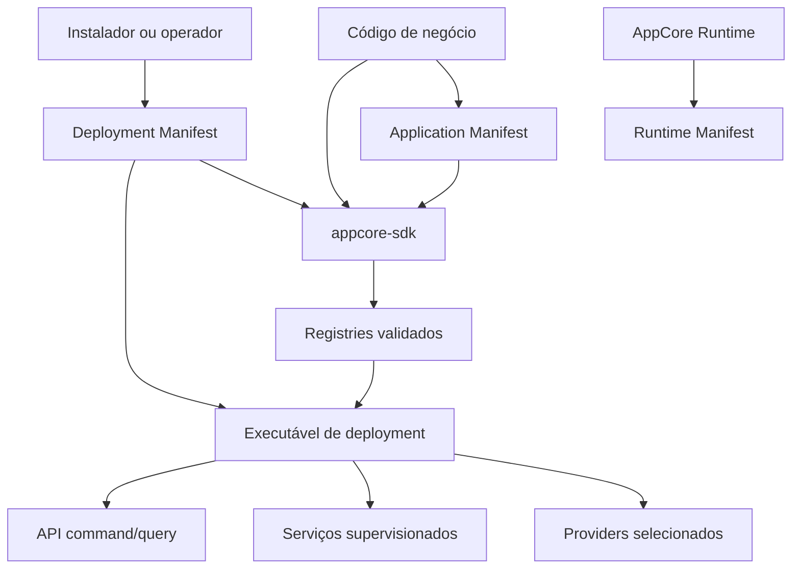
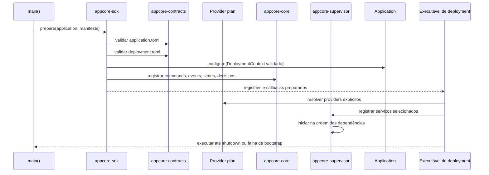

# O que é AppCore

Imagine a mesma aplicação instalada em dois lugares. Em uma loja ela roda em um notebook e precisa continuar funcionando sem internet. Em outra instalação ela roda em cluster, com control plane, leases, Peer RPC e update supervisionado. O código de negócio não deveria ter duas arquiteturas.

AppCore existe para essa fronteira.

Ele não é web framework, banco de dados, ERP ou plataforma de negócio. Ele é um runtime host que torna decisões de infraestrutura explícitas, versionadas e testáveis.

## O problema

Backends comuns acumulam comportamento oculto do Runtime:

- configuração mistura identidade, paths, secrets, rede e feature toggles;
- retries entram nos handlers em vez das fronteiras de command;
- jobs em background iniciam fora da supervisão de lifecycle;
- writes e backups ficam implícitos no client de database escolhido;
- liderança distribuída vira booleano em vez de lease com fencing token;
- updates trocam arquivos antes que o processo novo prove health.

AppCore separa ownership:

| Contrato | Dono | Contém | Não contém |
| --- | --- | --- | --- |
| Application Manifest | aplicação | identidade, compatibilidade, capabilities, requisitos | paths, provider IDs, endpoints, secrets |
| Deployment Manifest | instalação | modo, providers, rede, paths, secret refs, watchdog | regras de negócio, schemas, source |
| Runtime Manifest | runtime | versão observada, node/core, health, plataforma | overrides do usuário |
| Código de negócio | aplicação | commands, queries, handlers, state, decisions | composição do runtime |

## O que roda quando uma aplicação AppCore inicia

O código da aplicação usa `App::prepare` para validar manifests e reunir os
registros de negócio. O executável de deployment selecionado então possui a
composição:

Se os dois manifests não tiverem a mesma identidade, o bootstrap falha. Uma
config removida para na update wall com `NO MORE SUPPORTED PLEASE UPDATE`. Um
provider selecionado e ausente também falha, sem fallback silencioso.

## Quando usar

Use AppCore quando a aplicação precisa de:

- deployments local-first ou cluster;
- contratos explícitos de command e query;
- storage durável e policy de backup;
- endpoints de health e status pertencentes ao Runtime;
- serviços supervisionados;
- sync com validação de sequência e checkpoints;
- Peer RPC ou relay de Gateway entre cores;
- updates com autenticidade, staging, activation, health gate e rollback.

## Quando não usar

Evite quando um servidor HTTP stateless e um banco gerenciado bastam. AppCore
intencionalmente não fornece:

- ORM geral;
- workflows de produto;
- implementação OAuth;
- vault gerenciado de produção;
- terminação TLS inbound para todo deployment;
- RAFT ou consenso multi-master;
- resolução automática de conflitos de domínio.

## Limitations

- AppCore oferece contratos de runtime; ele não escreve o modelo de negócio.
- Deployments ainda precisam escolher providers, paths, secrets e process manager corretamente.
- O runtime valida envelopes e manifests, mas não prova que handlers de domínio estão corretos.
- A linha estável 1.0 prefere falha explícita a compatibilidade automática com formatos antigos.

Essas omissões são fronteiras de design. Elas mantêm a infraestrutura do
Runtime reutilizável por aplicações que não compartilham o mesmo domínio de
negócio. É também por isso que a documentação começa pelos manifests, e não
por uma lista de crates.

## Leia depois

Próximo capítulo: [contrato de três artefatos](/architecture/three-artifact-contract).
